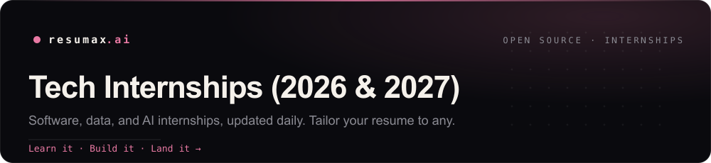

  

# Tech Internships (2026 & 2027)

Open software, data, AI/ML, security, and hardware **internships, co-ops, and working-student roles** for 2026 and 2027, refreshed daily and deduped across job boards. Every listing links into [ResuMax](https://resumax.ai/?utm_source=github&utm_medium=repo&utm_campaign=tech-internships&utm_content=intro), where **Atlas**, our AI career copilot, tailors your resume to it and preps you to ace the interview.

  

### A generic resume gets filtered. A tailored one gets the interview.

**[Tailor your resume to any role above &rarr;](https://resumax.ai/?utm_source=github&utm_medium=repo&utm_campaign=tech-internships&utm_content=cta-link)**

Atlas rewrites your resume to match each posting, scores it like a recruiter would, then runs you through the coding, system-design, and behavioral rounds so you walk in ready. Land the offer, not just the application.

**Found a role we're missing or a dead link?** [Open an issue](../../issues/new) and we'll fold it in.

## Open internships

**161** open, newest first.

🌐 Remote &nbsp;·&nbsp; 🆕 Posted this week

| Company | Role | Location | Apply | Tailor | Age |
|---|---|---|:--:|:--:|--:|
| **[Continental](https://resumax.ai/companies/continental?utm_source=github&utm_medium=repo&utm_campaign=tech-internships)** 🆕 | Mandatory Internship - Makers Garage / Data Scientist -… | Hannover, NDS, de | [Apply](https://jobs.smartrecruiters.com/continental/744000134234915) |  | 1d |
| **[jemix GmbH](https://resumax.ai/companies/jemix-gmbh?utm_source=github&utm_medium=repo&utm_campaign=tech-internships)** 🆕 | Werkstudent (m/w/d) – AI Engineer | Berlin | [Apply](https://www.arbeitnow.com/jobs/companies/jemix-gmbh/werkstudent-ai-engineer-berlin-434296) |  | 1d |
| **[Bosch Group](https://resumax.ai/companies/bosch-group?utm_source=github&utm_medium=repo&utm_campaign=tech-internships)** 🆕 | Praktikum Data Analysis & Software-Engineering UX | Stuttgart, BW, de | [Apply](https://jobs.smartrecruiters.com/boschgroup/744000134175009) |  | 1d |
| **[Jobsatphamily](https://resumax.ai/companies/jobsatphamily?utm_source=github&utm_medium=repo&utm_campaign=tech-internships)** 🆕 | Machine Learning Intern- Immediate Start | New York | [Apply](https://job-boards.greenhouse.io/jobsatphamily/jobs/5281239008) |  | 1d |
| **[Continental](https://resumax.ai/companies/continental?utm_source=github&utm_medium=repo&utm_campaign=tech-internships)** 🆕 | Internship – RFID and OT Infrastructure (partially mandatory) -… | Hannover, NDS, de | [Apply](https://jobs.smartrecruiters.com/continental/744000134236652) |  | 1d |
| **[Bosch Group](https://resumax.ai/companies/bosch-group?utm_source=github&utm_medium=repo&utm_campaign=tech-internships)** 🆕 | [Bosch R&D - Internship] Data Engineering Intern | Ho Chi Minh City, vn | [Apply](https://jobs.smartrecruiters.com/boschgroup/744000134169850) |  | 1d |
| **[Astranis](https://resumax.ai/companies/astranis?utm_source=github&utm_medium=repo&utm_campaign=tech-internships)** 🆕 | Hardware Design Intern, Software Defined Radio Team (Fall 2026) | San Francisco | [Apply](https://job-boards.greenhouse.io/astranis/jobs/4691163006) |  | 1d |
| **[Verkada](https://resumax.ai/companies/verkada?utm_source=github&utm_medium=repo&utm_campaign=tech-internships)** 🆕 | Frontend Software Engineering Intern - Fall 2026 | San Mateo, CA United States | [Apply](https://job-boards.greenhouse.io/verkada/jobs/5099529007) |  | 1d |
| **[Imc](https://resumax.ai/companies/imc?utm_source=github&utm_medium=repo&utm_campaign=tech-internships)** 🆕 | Hardware Machine Learning PhD Research Internship | Chicago, United States | [Apply](https://job-boards.eu.greenhouse.io/imc/jobs/4829785101) |  | 1d |
| **[Instacart](https://resumax.ai/companies/instacart?utm_source=github&utm_medium=repo&utm_campaign=tech-internships)** 🌐 🆕 | Machine Learning PhD Intern, Economics (Fall) | United States - Remote | [Apply](https://instacart.careers/job/?gh_jid=7532267) |  | 1d |
| **[Palantir](https://resumax.ai/companies/palantir?utm_source=github&utm_medium=repo&utm_campaign=tech-internships)** 🆕 | Year at Palantir - Forward Deployed Software Engineer,… | Chicago, IL · New York, NY | [Apply](https://jobs.lever.co/palantir/75cc1c09-8ebd-44c8-b3bc-d122cd1fecb3/apply) |  | 1d |
| **[Asteraearlycareer2026](https://resumax.ai/companies/asteraearlycareer2026?utm_source=github&utm_medium=repo&utm_campaign=tech-internships)** 🆕 | Firmware Engineer (Internship) - Vancouver | Vancouver, Canada | [Apply](https://job-boards.greenhouse.io/asteraearlycareer2026/jobs/4609356005) |  | 2d |
| **[Verkada](https://resumax.ai/companies/verkada?utm_source=github&utm_medium=repo&utm_campaign=tech-internships)** 🆕 | Backend Software Engineering Intern - Fall 2026 | San Mateo, CA United States | [Apply](https://job-boards.greenhouse.io/verkada/jobs/5099422007) |  | 1d |
| **[Instacart](https://resumax.ai/companies/instacart?utm_source=github&utm_medium=repo&utm_campaign=tech-internships)** 🌐 🆕 | Machine Learning Engineer, PhD Intern (Fall) | United States - Remote | [Apply](https://instacart.careers/job/?gh_jid=5917202) |  | 1d |
| **[Asteraearlycareer2026](https://resumax.ai/companies/asteraearlycareer2026?utm_source=github&utm_medium=repo&utm_campaign=tech-internships)** 🆕 | Field Application Engineering Intern | Taipei, Taiwan | [Apply](https://job-boards.greenhouse.io/asteraearlycareer2026/jobs/4670791005) |  | 2d |
| **[Heron Power](https://resumax.ai/companies/heron-power?utm_source=github&utm_medium=repo&utm_campaign=tech-internships)** 🆕 | Intern, Electronics Design Engineer, Spring 2027 | Scotts Valley | [Apply](https://jobs.ashbyhq.com/heron-power/796052b0-3811-4282-b1f9-7e6f83c3e87b/application) |  | 2d |
| **[Instagrid](https://resumax.ai/companies/instagrid?utm_source=github&utm_medium=repo&utm_campaign=tech-internships)** 🆕 | Working Student (f/m/d) - IT Infrastructure | Ludwigsburg | [Apply](https://www.arbeitnow.com/jobs/companies/instagrid/working-student-it-infrastructure-ludwigsburg-102098) |  | 2d |
| **[Think3DDD GbR](https://resumax.ai/companies/think3ddd-gbr?utm_source=github&utm_medium=repo&utm_campaign=tech-internships)** 🆕 | Pflichtpraktikum Frontend & UX Design (m/w/d) - React, UI/UX &… | Berlin | [Apply](https://www.arbeitnow.com/jobs/companies/think3ddd-gbr/pflichtpraktikum-frontend-ux-design-react-ui-ux-medtech-startup-berlin-292566) |  | 2d |
| **[Cirrus](https://resumax.ai/companies/cirrus?utm_source=github&utm_medium=repo&utm_campaign=tech-internships)** 🆕 | Fall 2026 Co-Op - Embedded Software AI Intern | Austin, Texas | [Apply](https://jobs.eu.lever.co/cirrus/3d6df577-91f6-4b58-9e7f-c982e49ff515/apply) |  | 3d |
| **[Altom Transport](https://resumax.ai/companies/altom-transport?utm_source=github&utm_medium=repo&utm_campaign=tech-internships)** 🆕 | Fall Software Development Intern | — | [Apply](https://apply.workable.com/j/9FC654F05E/apply) |  | 3d |
| **[Heron Power](https://resumax.ai/companies/heron-power?utm_source=github&utm_medium=repo&utm_campaign=tech-internships)** 🆕 | Intern, Electronics Design Engineer, Autumn 2026 | Scotts Valley | [Apply](https://jobs.ashbyhq.com/heron-power/28af5d2d-bd93-4681-9422-05d17c3437eb/application) |  | 2d |
| **[Intuitive](https://resumax.ai/companies/intuitive?utm_source=github&utm_medium=repo&utm_campaign=tech-internships)** 🆕 | Computer Vision Engineering Intern - Fall 2026 | Sunnyvale, CA, us | [Apply](https://jobs.smartrecruiters.com/intuitive/744000133458290) |  | 3d |
| **[Cresta](https://resumax.ai/companies/cresta?utm_source=github&utm_medium=repo&utm_campaign=tech-internships)** 🌐 🆕 | Data Science Intern (Customer Success) | United States (Remote) | [Apply](https://job-boards.greenhouse.io/cresta/jobs/5213417008) |  | 3d |
| **[Aevexaerospace](https://resumax.ai/companies/aevexaerospace?utm_source=github&utm_medium=repo&utm_campaign=tech-internships)** 🆕 | Robotics Engineering Co-op | Tampa, Florida, United States | [Apply](https://job-boards.greenhouse.io/aevexaerospace/jobs/5255526008) |  | 3d |
| **[Figure AI](https://resumax.ai/companies/figure-ai?utm_source=github&utm_medium=repo&utm_campaign=tech-internships)** 🆕 | Firmware Intern [Fall 2026] | San Jose, CA | [Apply](https://job-boards.greenhouse.io/figureai/jobs/4691070006) |  | 3d |
| **[Neuralink](https://resumax.ai/companies/neuralink?utm_source=github&utm_medium=repo&utm_campaign=tech-internships)** 🆕 | Firmware Engineer Intern, Robotics and Surgery Engineering | South San Francisco, California, United States | [Apply](https://boards.greenhouse.io/neuralink/jobs/6648992003?gh_jid=6648992003) |  | 3d |
| **[Sandisk](https://resumax.ai/companies/sandisk?utm_source=github&utm_medium=repo&utm_campaign=tech-internships)** 🆕 | #2 KR - FPE CE Backend Intern For CY26 Autumn Semeter | Seoul, Seoul, kr | [Apply](https://jobs.smartrecruiters.com/sandisk/744000133253260) |  | 4d |
| **[Moloco](https://resumax.ai/companies/moloco?utm_source=github&utm_medium=repo&utm_campaign=tech-internships)** 🆕 | Machine Learning Engineer Intern (3-month internship) | Seoul, Korea | [Apply](https://job-boards.greenhouse.io/moloco/jobs/7635045003) |  | 4d |
| **[Cresta](https://resumax.ai/companies/cresta?utm_source=github&utm_medium=repo&utm_campaign=tech-internships)** 🆕 | Software Engineer Intern | Toronto Canada | [Apply](https://job-boards.greenhouse.io/cresta/jobs/4123841008) |  | 3d |
| **[Neuralink](https://resumax.ai/companies/neuralink?utm_source=github&utm_medium=repo&utm_campaign=tech-internships)** 🆕 | Analog and Mixed-Signal IC Design Engineer Intern | South San Francisco, California, United States | [Apply](https://boards.greenhouse.io/neuralink/jobs/7565469003?gh_jid=7565469003) |  | 3d |
| **[Cresta](https://resumax.ai/companies/cresta?utm_source=github&utm_medium=repo&utm_campaign=tech-internships)** 🆕 | Machine Learning Engineering Intern | Toronto Canada | [Apply](https://job-boards.greenhouse.io/cresta/jobs/4123863008) |  | 3d |
| **[Neuralink](https://resumax.ai/companies/neuralink?utm_source=github&utm_medium=repo&utm_campaign=tech-internships)** 🆕 | Embedded Software Engineer Intern, Implant Embedded Systems | Austin, Texas, United States; South San Francisco, California, United States | [Apply](https://boards.greenhouse.io/neuralink/jobs/6283663003?gh_jid=6283663003) |  | 3d |
| **[Cresta](https://resumax.ai/companies/cresta?utm_source=github&utm_medium=repo&utm_campaign=tech-internships)** 🆕 | Forward Deployed Engineering Intern (AI Agent) | Toronto, Canada (Hybrid) | [Apply](https://job-boards.greenhouse.io/cresta/jobs/5106468008) |  | 3d |
| **[Neuralink](https://resumax.ai/companies/neuralink?utm_source=github&utm_medium=repo&utm_campaign=tech-internships)** 🆕 | Mechanical Engineering Intern, Robotics | South San Francisco, California, United States | [Apply](https://boards.greenhouse.io/neuralink/jobs/6514169003?gh_jid=6514169003) |  | 3d |
| **[Neuralink](https://resumax.ai/companies/neuralink?utm_source=github&utm_medium=repo&utm_campaign=tech-internships)** 🆕 | Machine Learning Engineer Intern | South San Francisco, California, United States | [Apply](https://boards.greenhouse.io/neuralink/jobs/6594261003?gh_jid=6594261003) |  | 3d |
| **[Neuralink](https://resumax.ai/companies/neuralink?utm_source=github&utm_medium=repo&utm_campaign=tech-internships)** 🆕 | Software Engineer Intern, BCI Applications | South San Francisco, California, United States | [Apply](https://boards.greenhouse.io/neuralink/jobs/6594422003?gh_jid=6594422003) |  | 3d |
| **[Neuralink](https://resumax.ai/companies/neuralink?utm_source=github&utm_medium=repo&utm_campaign=tech-internships)** 🆕 | Electrical Engineer Intern, Implant Embedded Systems | Austin, Texas, United States; South San Francisco, California, United States | [Apply](https://boards.greenhouse.io/neuralink/jobs/7702527003?gh_jid=7702527003) |  | 3d |
| **[Neuralink](https://resumax.ai/companies/neuralink?utm_source=github&utm_medium=repo&utm_campaign=tech-internships)** 🆕 | Digital IC Design Engineer Intern | Fremont, California, United States | [Apply](https://boards.greenhouse.io/neuralink/jobs/7090489003?gh_jid=7090489003) |  | 3d |
| **[Neuralink](https://resumax.ai/companies/neuralink?utm_source=github&utm_medium=repo&utm_campaign=tech-internships)** 🆕 | Software Engineer Intern, Infrastructure | South San Francisco, California, United States | [Apply](https://boards.greenhouse.io/neuralink/jobs/5469298003?gh_jid=5469298003) |  | 3d |
| **[Neuralink](https://resumax.ai/companies/neuralink?utm_source=github&utm_medium=repo&utm_campaign=tech-internships)** 🆕 | Software Engineer Intern, Implant | Austin, Texas, United States; South San Francisco, California, United States | [Apply](https://boards.greenhouse.io/neuralink/jobs/6569018003?gh_jid=6569018003) |  | 3d |
| **[Neuralink](https://resumax.ai/companies/neuralink?utm_source=github&utm_medium=repo&utm_campaign=tech-internships)** 🆕 | Software Engineer Intern, Robotics | Austin, Texas, United States; South San Francisco, California, United States | [Apply](https://boards.greenhouse.io/neuralink/jobs/5469305003?gh_jid=5469305003) |  | 3d |
| **[General Dynamics Missions System International](https://resumax.ai/companies/general-dynamics-missions-system-international?utm_source=github&utm_medium=repo&utm_campaign=tech-internships)** 🆕 | Co-op Fall 2026 - Software Developer - 8 Months | Cole Harbour, NS, ca | [Apply](https://jobs.smartrecruiters.com/gdmsi/744000133125725) |  | 6d |
| **[University Health Network](https://resumax.ai/companies/university-health-network?utm_source=github&utm_medium=repo&utm_campaign=tech-internships)** 🆕 | Junior Report Developer (Intern), Analytics and Insights | Toronto, ON, ca | [Apply](https://jobs.smartrecruiters.com/universityhealthnetwork/744000133121279) |  | 6d |
| **[Sharkninjaoperatingllc](https://resumax.ai/companies/sharkninjaoperatingllc?utm_source=github&utm_medium=repo&utm_campaign=tech-internships)** 🆕 | Summer 2026: RoboShark Internship, Robotics & Mechatronics… | Needham, MA, United States | [Apply](https://job-boards.greenhouse.io/sharkninjaoperatingllc/jobs/4690392006) |  | 6d |
| **[Estateanfrage](https://resumax.ai/companies/estateanfrage?utm_source=github&utm_medium=repo&utm_campaign=tech-internships)** | Werkstudent AI Engineer (m/w/d) | Munich | [Apply](https://www.arbeitnow.com/jobs/companies/estateanfrage/werkstudent-ai-engineer-munich-182315) |  | 7d |
| **[Bosch Group](https://resumax.ai/companies/bosch-group?utm_source=github&utm_medium=repo&utm_campaign=tech-internships)** | Pflichtpraktikum Angular Frontend Entwicklung / Webdesign | Renningen, BW, de | [Apply](https://jobs.smartrecruiters.com/boschgroup/744000133008664) |  | 7d |
| **[Bosch Group](https://resumax.ai/companies/bosch-group?utm_source=github&utm_medium=repo&utm_campaign=tech-internships)** | [BGSV/PJ-NE] Software Engineer Intern (Python,… | Ho Chi Minh, vn | [Apply](https://jobs.smartrecruiters.com/boschgroup/744000133000519) |  | 7d |
| **[Weber Agrar Robotik GmbH](https://resumax.ai/companies/weber-agrar-robotik-gmbh?utm_source=github&utm_medium=repo&utm_campaign=tech-internships)** | Werkstudent Drohnentechnik Elektronik & Software (m/w/d) | Eberstadt | [Apply](https://www.arbeitnow.com/jobs/companies/weber-agrar-robotik-gmbh/werkstudent-drohnentechnik-elektronik-software-eberstadt-313718) |  | 7d |
| **[Sia](https://resumax.ai/companies/sia?utm_source=github&utm_medium=repo&utm_campaign=tech-internships)** | Final year internship - DevOps / Platform Engineer | Paris, IDF, fr | [Apply](https://jobs.smartrecruiters.com/sia/744000132850589) |  | 8d |
| **[SpielundLern GmbH](https://resumax.ai/companies/spielundlern-gmbh?utm_source=github&utm_medium=repo&utm_campaign=tech-internships)** | Werkstudent (m/w/d) - E-Commerce, Produktmanagement &… | Neumarkt in der Oberpfalz | [Apply](https://www.arbeitnow.com/jobs/companies/spielundlern-gmbh/werkstudent-e-commerce-produktmanagement-softwareentwicklung-neumarkt-in-der-oberpfalz-383054) |  | 8d |
| **[Western Digital](https://resumax.ai/companies/western-digital?utm_source=github&utm_medium=repo&utm_campaign=tech-internships)** | Intern - Software Development App | BangPa-in, PHRA NAKHON SI AYUTTHAYA, th | [Apply](https://jobs.smartrecruiters.com/westerndigital/744000132824433) |  | 8d |
| **[Sandisk](https://resumax.ai/companies/sandisk?utm_source=github&utm_medium=repo&utm_campaign=tech-internships)** | [July Onwards Intake] Internship - Product Design Engineering | Batu Kawan, Penang, my | [Apply](https://jobs.smartrecruiters.com/sandisk/744000132804489) |  | 8d |
| **[Bosch Group](https://resumax.ai/companies/bosch-group?utm_source=github&utm_medium=repo&utm_campaign=tech-internships)** | Pflichtpraktikum im direkten Einkauf - Software und Daten | Stuttgart, BW, de | [Apply](https://jobs.smartrecruiters.com/boschgroup/744000132772029) |  | 8d |
| **[Western Digital](https://resumax.ai/companies/western-digital?utm_source=github&utm_medium=repo&utm_campaign=tech-internships)** | Intern - Web Developer | Amphoe Si Maha Phot, Prachin Buri, th · BangPa-in, PHRA NAKHON SI AYUTTHAYA, th | [Apply](https://jobs.smartrecruiters.com/westerndigital/744000132806234) |  | 8d |
| **[Citi](https://resumax.ai/companies/citi?utm_source=github&utm_medium=repo&utm_campaign=tech-internships)** | Digital Software Engineering Intern | Irving, TX | [Apply](https://citi.wd5.myworkdayjobs.com/2/job/Irving-Texas-United-States/Digital-S-W-Engineer-Intm-Analyst-Officer--Irving-_26956642) |  | 8d |
| **[Astranis](https://resumax.ai/companies/astranis?utm_source=github&utm_medium=repo&utm_campaign=tech-internships)** | Flight Software Intern (Fall 2026) | San Francisco | [Apply](https://job-boards.greenhouse.io/astranis/jobs/4619283006) |  | 8d |
| **[Man Group](https://resumax.ai/companies/man-group?utm_source=github&utm_medium=repo&utm_campaign=tech-internships)** | Quantitative Developer, Intern | Shanghai | [Apply](https://job-boards.eu.greenhouse.io/mangroup/jobs/4847708101) |  | 8d |
| **[Bosch Group](https://resumax.ai/companies/bosch-group?utm_source=github&utm_medium=repo&utm_campaign=tech-internships)** | Pflichtpraktikum Data Science im Qualitätsmanagement | Stuttgart, BW, de | [Apply](https://jobs.smartrecruiters.com/boschgroup/744000132621204) |  | 9d |
| **[Blickfeld GmbH](https://resumax.ai/companies/blickfeld-gmbh?utm_source=github&utm_medium=repo&utm_campaign=tech-internships)** | Working Student / IDP: Software Development (m/f/d) | Munich | [Apply](https://www.arbeitnow.com/jobs/companies/blickfeld-gmbh/working-student-idp-software-development-munich-326764) |  | 9d |
| **[Anduril Industries](https://resumax.ai/companies/anduril-industries?utm_source=github&utm_medium=repo&utm_campaign=tech-internships)** | 2027 Software Engineer Intern | Atlanta, Georgia, United States; Boston, Massachusetts, United States; Costa Mesa, California, United States; Irvine, California, United States; Reston, Virginia, United States; Seattle, Washington, United States | [Apply](https://boards.greenhouse.io/andurilindustries/jobs/5148079007?gh_jid=5148079007) |  | 9d |
| **[Drwuniversityjobs](https://resumax.ai/companies/drwuniversityjobs?utm_source=github&utm_medium=repo&utm_campaign=tech-internships)** | Software Developer Intern - Industrial Placement | London | [Apply](https://job-boards.greenhouse.io/drwuniversityjobs/jobs/7364884) |  | 9d |
| **[Bosch Group](https://resumax.ai/companies/bosch-group?utm_source=github&utm_medium=repo&utm_campaign=tech-internships)** | Cloud Developer Internship | Beograd, rs | [Apply](https://jobs.smartrecruiters.com/boschgroup/744000132577425) |  | 9d |
| **[Blickfeld GmbH](https://resumax.ai/companies/blickfeld-gmbh?utm_source=github&utm_medium=repo&utm_campaign=tech-internships)** | Werkstudent*in / IDP: Software Development (m/f/d) | Munich | [Apply](https://www.arbeitnow.com/jobs/companies/blickfeld-gmbh/werkstudentin-idp-software-development-munich-172638) |  | 9d |
| **[Ispottv](https://resumax.ai/companies/ispottv?utm_source=github&utm_medium=repo&utm_campaign=tech-internships)** | Data Science Intern | Bellevue, WA | [Apply](https://job-boards.greenhouse.io/ispottv/jobs/4703297005) |  | 9d |
| **[Stripe](https://resumax.ai/companies/stripe?utm_source=github&utm_medium=repo&utm_campaign=tech-internships)** | PhD Data Scientist, Intern | San Francisco, New York City, Seattle, Chicago | [Apply](https://stripe.com/jobs/search?gh_jid=7874965) |  | 9d |
| **[Rocketlab](https://resumax.ai/companies/rocketlab?utm_source=github&utm_medium=repo&utm_campaign=tech-internships)** | Software Intern Fall 2026 | Albuquerque, NM | [Apply](https://job-boards.greenhouse.io/rocketlab/jobs/7736776003) |  | 9d |
| **[Faire](https://resumax.ai/companies/faire?utm_source=github&utm_medium=repo&utm_campaign=tech-internships)** | Data Science Intern | San Francisco, CA | [Apply](https://boards.greenhouse.io/faire/jobs/8376377002?gh_jid=8376377002) |  | 9d |
| **[Verkada](https://resumax.ai/companies/verkada?utm_source=github&utm_medium=repo&utm_campaign=tech-internships)** | AI Software Engineering Intern - Fall 2026 | San Mateo, CA United States | [Apply](https://job-boards.greenhouse.io/verkada/jobs/5117760007) |  | 9d |
| **[Smiths Group](https://resumax.ai/companies/smiths-group?utm_source=github&utm_medium=repo&utm_campaign=tech-internships)** | Customer Reliability Engineer Intern (PT) | Port Arthur, TX, us | [Apply](https://jobs.smartrecruiters.com/smithsgroup2/744000132470530) |  | 9d |
| **[Maticrobots](https://resumax.ai/companies/maticrobots?utm_source=github&utm_medium=repo&utm_campaign=tech-internships)** | Robotics Customer Operations Intern | Menlo Park, CA | [Apply](https://jobs.ashbyhq.com/maticrobots/a923166f-ddce-4b4c-9797-0a30ef56b9a5/application) |  | 10d |
| **[Jobs for Humanity](https://resumax.ai/companies/jobs-for-humanity?utm_source=github&utm_medium=repo&utm_campaign=tech-internships)** | Front-End React Intern (Summer, Remote, France) | Paris, fr | [Apply](https://jobs.smartrecruiters.com/jobsforhumanity/744000132195759) |  | 11d |
| **[etalytics GmbH](https://resumax.ai/companies/etalytics-gmbh?utm_source=github&utm_medium=repo&utm_campaign=tech-internships)** | Internship / Thesis: Angular Frontend Development (f/m/d) | Darmstadt | [Apply](https://www.arbeitnow.com/jobs/companies/etalytics-gmbh/internship-thesis-angular-frontend-development-darmstadt-330952) |  | 11d |
| **[Sicherheit Nord](https://resumax.ai/companies/sicherheit-nord?utm_source=github&utm_medium=repo&utm_campaign=tech-internships)** | Werkstudent Softwareentwicklung (m/w/d) | Berlin | [Apply](https://www.arbeitnow.com/jobs/companies/sicherheit-nord/werkstudent-softwareentwicklung-berlin-274701) |  | 13d |
| **[Astranis](https://resumax.ai/companies/astranis?utm_source=github&utm_medium=repo&utm_campaign=tech-internships)** | Harness Design Engineer Intern (Fall 2026) | San Francisco | [Apply](https://job-boards.greenhouse.io/astranis/jobs/4597559006) |  | 13d |
| **[Point72](https://resumax.ai/companies/point72?utm_source=github&utm_medium=repo&utm_campaign=tech-internships)** | Quantitative Developer Intern | New York | [Apply](https://boards.greenhouse.io/point72/jobs/7609197002?gh_jid=7609197002) |  | 13d |
| **[Sharkninjaoperatingllc](https://resumax.ai/companies/sharkninjaoperatingllc?utm_source=github&utm_medium=repo&utm_campaign=tech-internships)** | Fall 2026: Product Design Engineering Co-op, Shark (July to… | Needham, MA, United States | [Apply](https://job-boards.greenhouse.io/sharkninjaoperatingllc/jobs/4646411006) |  | 13d |
| **[RoX Health GmbH](https://resumax.ai/companies/rox-health-gmbh?utm_source=github&utm_medium=repo&utm_campaign=tech-internships)** | Agentic Innovation Developer - Werkstudent (m/w/d) | Berlin | [Apply](https://www.arbeitnow.com/jobs/companies/rox-health-gmbh/agentic-innovation-developer-werkstudent-berlin-168469) |  | 14d |
| **[Bosch Group](https://resumax.ai/companies/bosch-group?utm_source=github&utm_medium=repo&utm_campaign=tech-internships)** | [EDS] Python Developer Intern | Tân Bình, Hồ Chí Minh, vn | [Apply](https://jobs.smartrecruiters.com/boschgroup/744000131829177) |  | 14d |
| **[DevBoost GmbH](https://resumax.ai/companies/devboost-gmbh?utm_source=github&utm_medium=repo&utm_campaign=tech-internships)** | Werkstudent Softwareentwicklung (m/w/d) | Dresden | [Apply](https://www.arbeitnow.com/jobs/companies/devboost-gmbh/werkstudent-softwareentwicklung-dresden-180067) |  | 14d |
| **[disruptive GmbH](https://resumax.ai/companies/disruptive-gmbh?utm_source=github&utm_medium=repo&utm_campaign=tech-internships)** | Werkstudent:in AI Engineering (m/w/d) | Munich | [Apply](https://www.arbeitnow.com/jobs/companies/disruptive-gmbh/werkstudentin-ai-engineering-munich-147077) |  | 14d |
| **[Astranis](https://resumax.ai/companies/astranis?utm_source=github&utm_medium=repo&utm_campaign=tech-internships)** | Software Engineer- Backend Intern (Fall 2026) | San Francisco, CA | [Apply](https://job-boards.greenhouse.io/astranis/jobs/4681183006) |  | 13d |
| **[Point72](https://resumax.ai/companies/point72?utm_source=github&utm_medium=repo&utm_campaign=tech-internships)** | 2026 Technology Internship – Software Engineer | Warsaw, Poland | [Apply](https://boards.greenhouse.io/point72/jobs/8406727002?gh_jid=8406727002) |  | 13d |
| **[Astranis](https://resumax.ai/companies/astranis?utm_source=github&utm_medium=repo&utm_campaign=tech-internships)** | Embedded Software Developer, Network/Payload Software Intern… | San Francisco | [Apply](https://job-boards.greenhouse.io/astranis/jobs/4601135006) |  | 13d |
| **[Point72](https://resumax.ai/companies/point72?utm_source=github&utm_medium=repo&utm_campaign=tech-internships)** | Machine Learning Researcher - Intern | New York | [Apply](https://boards.greenhouse.io/point72/jobs/7302611002?gh_jid=7302611002) |  | 13d |
| **[Point72](https://resumax.ai/companies/point72?utm_source=github&utm_medium=repo&utm_campaign=tech-internships)** | 2026 Warsaw Market Intelligence – Platform DevOps Internship | Warsaw, Poland | [Apply](https://boards.greenhouse.io/point72/jobs/8425028002?gh_jid=8425028002) |  | 13d |
| **[Lucidmotors](https://resumax.ai/companies/lucidmotors?utm_source=github&utm_medium=repo&utm_campaign=tech-internships)** | Full Stack Engineer Intern | Amsterdam, NH | [Apply](https://job-boards.greenhouse.io/lucidmotors/jobs/5136395007) |  | 15d |
| **[Continental](https://resumax.ai/companies/continental?utm_source=github&utm_medium=repo&utm_campaign=tech-internships)** | Internship/ Master Thesis - Machine Learning and Control… | Hannover, NDS, de | [Apply](https://jobs.smartrecruiters.com/continental/744000131596646) |  | 15d |
| **[NielsenIQ](https://resumax.ai/companies/nielseniq?utm_source=github&utm_medium=repo&utm_campaign=tech-internships)** | Data Science Intern | Kuala Lumpur, 14, my | [Apply](https://jobs.smartrecruiters.com/nielseniq/744000131589861) |  | 15d |
| **[Field Ai](https://resumax.ai/companies/field-ai?utm_source=github&utm_medium=repo&utm_campaign=tech-internships)** | Field Application Engineer -Intern | Irvine, CA | [Apply](https://jobs.lever.co/field-ai/9c2b7b13-12d0-4c1a-a672-8c869228ec9d/apply) |  | 15d |
| **[Diamclean GmbH](https://resumax.ai/companies/diamclean-gmbh?utm_source=github&utm_medium=repo&utm_campaign=tech-internships)** | Pflichtpraktikum Produktmarketing & Software Launch (m/w/d) | Horhausen | [Apply](https://www.arbeitnow.com/jobs/companies/diamclean-gmbh/pflichtpraktikum-produktmarketing-software-launch-horhausen-109961) |  | 15d |
| **[Zip](https://resumax.ai/companies/zip?utm_source=github&utm_medium=repo&utm_campaign=tech-internships)** 🌐 | Software Engineer Intern (Fall 2026) | Toronto | [Apply](https://jobs.ashbyhq.com/zip/caa5ba75-3b38-4d29-88cd-69a90b01fd6f/application) |  | 16d |
| **[Truveta](https://resumax.ai/companies/truveta?utm_source=github&utm_medium=repo&utm_campaign=tech-internships)** | Software Engineering Intern | Seattle, WA | [Apply](https://job-boards.greenhouse.io/truveta/jobs/5659745004) |  | 17d |
| **[Tenstorrentuniversity](https://resumax.ai/companies/tenstorrentuniversity?utm_source=github&utm_medium=repo&utm_campaign=tech-internships)** | Machine Learning for Physical Design Intern - CPU/AI Hardware | Santa Clara, California, United States · Austin, Texas, United States | [Apply](https://job-boards.greenhouse.io/tenstorrentuniversity/jobs/4968215007) |  | 17d |
| **[Sia](https://resumax.ai/companies/sia?utm_source=github&utm_medium=repo&utm_campaign=tech-internships)** | Final year internship - Marketing Data Scientist | Paris, IDF, fr | [Apply](https://jobs.smartrecruiters.com/sia/744000130799669) |  | 18d |
| **[Stripe](https://resumax.ai/companies/stripe?utm_source=github&utm_medium=repo&utm_campaign=tech-internships)** | Software Engineer, Intern | Sydney, Australia | [Apply](https://stripe.com/jobs/search?gh_jid=7532256) |  | 18d |
| **[Tenstorrentuniversity](https://resumax.ai/companies/tenstorrentuniversity?utm_source=github&utm_medium=repo&utm_campaign=tech-internships)** | Software Intern - AI Compilers | Santa Clara, California, United States · Austin, Texas, United States | [Apply](https://job-boards.greenhouse.io/tenstorrentuniversity/jobs/4501189007) |  | 17d |
| **[Sia](https://resumax.ai/companies/sia?utm_source=github&utm_medium=repo&utm_campaign=tech-internships)** | Final year internship - Data Scientist & AI Consultant | Paris, IDF, fr | [Apply](https://jobs.smartrecruiters.com/sia/744000130797286) |  | 18d |
| **[Tenstorrentuniversity](https://resumax.ai/companies/tenstorrentuniversity?utm_source=github&utm_medium=repo&utm_campaign=tech-internships)** | Machine Learning Intern, AI Compiler - Model Training (Serbia) | Belgrade, Serbia | [Apply](https://job-boards.greenhouse.io/tenstorrentuniversity/jobs/5076959007) |  | 17d |
| **[Tenstorrentuniversity](https://resumax.ai/companies/tenstorrentuniversity?utm_source=github&utm_medium=repo&utm_campaign=tech-internships)** | Software Engineer Intern, AI Compiler (Serbia) | Belgrade, Serbia | [Apply](https://job-boards.greenhouse.io/tenstorrentuniversity/jobs/5080887007) |  | 17d |
| **[Tenstorrentuniversity](https://resumax.ai/companies/tenstorrentuniversity?utm_source=github&utm_medium=repo&utm_campaign=tech-internships)** | Design Verification Software Intern | North America | [Apply](https://job-boards.greenhouse.io/tenstorrentuniversity/jobs/4522665007) |  | 17d |
| **[Tenstorrentuniversity](https://resumax.ai/companies/tenstorrentuniversity?utm_source=github&utm_medium=repo&utm_campaign=tech-internships)** | AI Compiler Software Intern (PEY) | Toronto, Ontario, Canada | [Apply](https://job-boards.greenhouse.io/tenstorrentuniversity/jobs/4873659007) |  | 17d |
| **[Tenstorrentuniversity](https://resumax.ai/companies/tenstorrentuniversity?utm_source=github&utm_medium=repo&utm_campaign=tech-internships)** | Software Engineering Intern, Kernel Optimization (Serbia) | Belgrade, Serbia | [Apply](https://job-boards.greenhouse.io/tenstorrentuniversity/jobs/5096351007) |  | 17d |
| **[Tenstorrentuniversity](https://resumax.ai/companies/tenstorrentuniversity?utm_source=github&utm_medium=repo&utm_campaign=tech-internships)** | Acceleration Kernel Developer Intern | Santa Clara, California, United States | [Apply](https://job-boards.greenhouse.io/tenstorrentuniversity/jobs/4668120007) |  | 17d |
| **[Tenstorrentuniversity](https://resumax.ai/companies/tenstorrentuniversity?utm_source=github&utm_medium=repo&utm_campaign=tech-internships)** | ML Models Implementation & Performance Optimization, Intern… | Belgrade, Serbia | [Apply](https://job-boards.greenhouse.io/tenstorrentuniversity/jobs/5082990007) |  | 17d |
| **[Tenstorrentuniversity](https://resumax.ai/companies/tenstorrentuniversity?utm_source=github&utm_medium=repo&utm_campaign=tech-internships)** | Inference Server – Product Software Intern | Belgrade, Serbia | [Apply](https://job-boards.greenhouse.io/tenstorrentuniversity/jobs/5065140007) |  | 17d |
| **[Samsungresearchamericainternship](https://resumax.ai/companies/samsungresearchamericainternship?utm_source=github&utm_medium=repo&utm_campaign=tech-internships)** | 2026 Fall Intern, Computer Vision/AI | 665 Clyde Avenue, Mountain View,  CA, USA | [Apply](https://job-boards.greenhouse.io/samsungresearchamericainternship/jobs/8560657002) |  | 20d |
| **[Samsungresearchamericainternship](https://resumax.ai/companies/samsungresearchamericainternship?utm_source=github&utm_medium=repo&utm_campaign=tech-internships)** | 2026 Fall Intern, ML/NLP Research | 665 Clyde Avenue, Mountain View,  CA, USA | [Apply](https://job-boards.greenhouse.io/samsungresearchamericainternship/jobs/8541339002) |  | 20d |
| **[Neuralink](https://resumax.ai/companies/neuralink?utm_source=github&utm_medium=repo&utm_campaign=tech-internships)** | Electrical Engineer Intern, Robotics and Surgery Engineering | South San Francisco, California, United States | [Apply](https://boards.greenhouse.io/neuralink/jobs/6607398003?gh_jid=6607398003) |  | 21d |
| **[Al Warren Oil Company Inc.](https://resumax.ai/companies/al-warren-oil-company-inc?utm_source=github&utm_medium=repo&utm_campaign=tech-internships)** | Software Developer - Fall Internship 2026 | — | [Apply](https://apply.workable.com/j/345DC0E6D4/apply) |  | 23d |
| **[Heron Power](https://resumax.ai/companies/heron-power?utm_source=github&utm_medium=repo&utm_campaign=tech-internships)** | Intern, System Integration & Test Software | Scotts Valley | [Apply](https://jobs.ashbyhq.com/heron-power/807ae67d-1571-4f85-b597-224d0d4db784/application) |  | 23d |
| **[Snowflake](https://resumax.ai/companies/snowflake?utm_source=github&utm_medium=repo&utm_campaign=tech-internships)** | Software Engineer Intern (AI/ML) - 2026 | PL-Warsaw | [Apply](https://jobs.ashbyhq.com/snowflake/897e1850-c590-4462-b187-0516b65b2034/application) |  | 24d |
| **[Snowflake](https://resumax.ai/companies/snowflake?utm_source=github&utm_medium=repo&utm_campaign=tech-internships)** | Software Engineer Intern - Berlin (2026) | DE-Berlin-Trion Building | [Apply](https://jobs.ashbyhq.com/snowflake/41e65c6c-a01e-4f40-af14-ae75d3b95e27/application) |  | 24d |
| **[Accel Learning](https://resumax.ai/companies/accel-learning?utm_source=github&utm_medium=repo&utm_campaign=tech-internships)** 🌐 | AI Engineer (Internship) - Intelligent Question Bank Platform | Secaucus, NJ, us | [Apply](https://jobs.smartrecruiters.com/accellearning/744000129584829) |  | 24d |
| **[Palantir](https://resumax.ai/companies/palantir?utm_source=github&utm_medium=repo&utm_campaign=tech-internships)** | Forward Deployed Software Engineer, Internship - AUS Government | Sydney, Australia | [Apply](https://jobs.lever.co/palantir/395a4483-fc3d-4b77-a500-501923fd0976/apply) |  | 28d |
| **[Pony. AI](https://resumax.ai/companies/pony-ai?utm_source=github&utm_medium=repo&utm_campaign=tech-internships)** | Software Engineer Intern - Generalist | — | [Apply](https://apply.workable.com/j/BA5FFDBC71/apply) |  | 28d |
| **[Ekimetrics](https://resumax.ai/companies/ekimetrics?utm_source=github&utm_medium=repo&utm_campaign=tech-internships)** | Internship September 2026 - Agentic AI for Semi-Automating the… | Paris | [Apply](https://jobs.lever.co/ekimetrics/fde67ae0-dd06-46af-8a3e-a6372107f88d/apply) |  | 28d |
| **[Western Digital](https://resumax.ai/companies/western-digital?utm_source=github&utm_medium=repo&utm_campaign=tech-internships)** | Intern - Web Developer (Start in January 2027) | Amphoe Si Maha Phot, Prachin Buri, th | [Apply](https://jobs.smartrecruiters.com/westerndigital/744000128870069) |  | 29d |
| **[Pony. AI](https://resumax.ai/companies/pony-ai?utm_source=github&utm_medium=repo&utm_campaign=tech-internships)** | Research Intern - Deep Learning | — | [Apply](https://apply.workable.com/j/4C1F53EF5D/apply) |  | 29d |
| **[Western Digital](https://resumax.ai/companies/western-digital?utm_source=github&utm_medium=repo&utm_campaign=tech-internships)** | Intern - Product Design Engineering (Studying Bachelor Degree) | Amphoe Si Maha Phot, Prachin Buri, th | [Apply](https://jobs.smartrecruiters.com/westerndigital/744000128857549) |  | 29d |
| **[Skydio](https://resumax.ai/companies/skydio?utm_source=github&utm_medium=repo&utm_campaign=tech-internships)** 🌐 | Autonomy Engineer Intern - Deep Learning (Computational… | Zurich, Switzerland · San Mateo, California, United States | [Apply](https://jobs.ashbyhq.com/skydio/92a7a891-d332-459c-9aa8-e96afea4f2a4/application) |  | 29d |
| **[Maintainx](https://resumax.ai/companies/maintainx?utm_source=github&utm_medium=repo&utm_campaign=tech-internships)** | Software Development Intern | Montreal, Quebec | [Apply](https://job-boards.greenhouse.io/maintainx/jobs/5146022007) |  | 29d |
| **[Thenewyorktimes](https://resumax.ai/companies/thenewyorktimes?utm_source=github&utm_medium=repo&utm_campaign=tech-internships)** | Software Engineer, Scoop Core | New York, NY | [Apply](https://job-boards.greenhouse.io/thenewyorktimes/jobs/4673616005) |  | 29d |
| **[Western Digital](https://resumax.ai/companies/western-digital?utm_source=github&utm_medium=repo&utm_campaign=tech-internships)** | Intern - AI/ML Development Engineer | BangPa-in, PHRA NAKHON SI AYUTTHAYA, th | [Apply](https://jobs.smartrecruiters.com/westerndigital/744000128672344) |  | 30d |
| **[Skydio](https://resumax.ai/companies/skydio?utm_source=github&utm_medium=repo&utm_campaign=tech-internships)** 🌐 | PhD Autonomy Engineer Intern - Deep Learning or Computer Vision | Zurich, Switzerland | [Apply](https://jobs.ashbyhq.com/skydio/c783c8dd-f604-47d0-aae0-187af89c81b4/application) |  | 29d |
| **[Skydio](https://resumax.ai/companies/skydio?utm_source=github&utm_medium=repo&utm_campaign=tech-internships)** 🌐 | Autonomy Engineer Intern - Computer Vision/Deep Learning Fall… | Zurich, Switzerland | [Apply](https://jobs.ashbyhq.com/skydio/611a7f87-bc4c-468f-976f-ecd33b731fa3/application) |  | 29d |
| **[Base Power](https://resumax.ai/companies/base-power?utm_source=github&utm_medium=repo&utm_campaign=tech-internships)** | Quantitative Developer Intern | Austin, TX | [Apply](https://jobs.ashbyhq.com/base-power/b6b2332e-1226-4575-b2c9-9e5258f2540e/application) |  | 30d |
| **[Thealleninstitute](https://resumax.ai/companies/thealleninstitute?utm_source=github&utm_medium=repo&utm_campaign=tech-internships)** | Research Internship, Robotics | Seattle, WA | [Apply](https://job-boards.greenhouse.io/thealleninstitute/jobs/7366273) |  | 30d |
| **[Atpco](https://resumax.ai/companies/atpco?utm_source=github&utm_medium=repo&utm_campaign=tech-internships)** 🌐 | Cloud Engineer Intern — Flexible Remote Fall Internship… | Herndon, VA, us | [Apply](https://jobs.smartrecruiters.com/atpco1/744000128563576) |  | 30d |
| **[Base Power](https://resumax.ai/companies/base-power?utm_source=github&utm_medium=repo&utm_campaign=tech-internships)** | Software Engineering Intern | Austin, TX | [Apply](https://jobs.ashbyhq.com/base-power/5353ea33-57d4-46fa-9a96-e392a3f841bc/application) |  | 30d |
| **[Base Power](https://resumax.ai/companies/base-power?utm_source=github&utm_medium=repo&utm_campaign=tech-internships)** | Firmware Engineering Intern | Austin, TX | [Apply](https://jobs.ashbyhq.com/base-power/a8ee9a66-e90b-42c2-a4a2-28d997c3e8c7/application) |  | 30d |
| **[Ftandinternships](https://resumax.ai/companies/ftandinternships?utm_source=github&utm_medium=repo&utm_campaign=tech-internships)** | Developer Internship | Radnor, PA | [Apply](https://job-boards.greenhouse.io/ftandinternships/jobs/1304476) |  | 33d |
| **[Skydio](https://resumax.ai/companies/skydio?utm_source=github&utm_medium=repo&utm_campaign=tech-internships)** 🌐 | Middleware Software Engineer Intern - Fall 2026 | San Mateo, California, United States | [Apply](https://jobs.ashbyhq.com/skydio/7d9dbb60-4ca1-4ba8-8bae-5ebfded4a915/application) |  | 35d |
| **[Reply](https://resumax.ai/companies/reply?utm_source=github&utm_medium=repo&utm_campaign=tech-internships)** | iOS Developer Intern | Detroit Area, Michigan | [Apply](https://jobs.lever.co/reply/191d1794-e52a-4573-a2d0-2952b76f9cd5/apply) |  | 35d |
| **[Reply](https://resumax.ai/companies/reply?utm_source=github&utm_medium=repo&utm_campaign=tech-internships)** | Android Developer Intern | Detroit Area, Michigan | [Apply](https://jobs.lever.co/reply/0fb458db-7cb9-4bfd-b9b6-c1c681316061/apply) |  | 35d |
| **[Uipath](https://resumax.ai/companies/uipath?utm_source=github&utm_medium=repo&utm_campaign=tech-internships)** | Front-End Software Engineer Intern | Bucharest | [Apply](https://jobs.ashbyhq.com/uipath/b262761e-ae68-48ab-b82c-8b41ad647a6f/application) |  | 36d |
| **[Etched](https://resumax.ai/companies/etched?utm_source=github&utm_medium=repo&utm_campaign=tech-internships)** | Chip Simulation Software Intern | San Jose | [Apply](https://jobs.ashbyhq.com/etched/27e5bd6b-9357-45f0-9e79-cfa2bf4eeba8/application) |  | 37d |
| **[Cohere](https://resumax.ai/companies/cohere?utm_source=github&utm_medium=repo&utm_campaign=tech-internships)** 🌐 | Machine Learning Intern/Co-op  (Fall, 2026) | Canada | [Apply](https://jobs.ashbyhq.com/cohere/36d1f52f-8270-4652-adf5-5303a0ff341b/application) |  | 43d |
| **[Shift Technology](https://resumax.ai/companies/shift-technology?utm_source=github&utm_medium=repo&utm_campaign=tech-internships)** | Data Scientist Internship (6 months) | France - Paris | [Apply](https://job-boards.greenhouse.io/shifttechnology/jobs/7640352003) |  | 44d |
| **[quadric, Inc](https://resumax.ai/companies/quadric-inc?utm_source=github&utm_medium=repo&utm_campaign=tech-internships)** | Data Science Intern - Model Optimization | — | [Apply](https://apply.workable.com/j/52EA39411C/apply) |  | 45d |
| **[Eluvio](https://resumax.ai/companies/eluvio?utm_source=github&utm_medium=repo&utm_campaign=tech-internships)** | Last Minute AI-Machine Learning Summer Internship (Gen AI -… | — | [Apply](https://apply.workable.com/j/F70F3473E7/apply) |  | 48d |
| **[Palantir](https://resumax.ai/companies/palantir?utm_source=github&utm_medium=repo&utm_campaign=tech-internships)** | Forward Deployed Software Engineer, Internship | Paris, France | [Apply](https://jobs.lever.co/palantir/1b6f1d82-d459-4dea-8bc2-8d2ffe6f881a/apply) |  | 51d |
| **[Skydio](https://resumax.ai/companies/skydio?utm_source=github&utm_medium=repo&utm_campaign=tech-internships)** | Software Engineer Intern Fall 2026/Winter 2027 | San Mateo, California, United States | [Apply](https://jobs.ashbyhq.com/skydio/f6320e9b-4eed-408d-8d37-d509fb0406ee/application) |  | 51d |
| **[Cohere](https://resumax.ai/companies/cohere?utm_source=github&utm_medium=repo&utm_campaign=tech-internships)** 🌐 | Software Engineer Intern (Fall / Winter 2026) | Canada | [Apply](https://jobs.ashbyhq.com/cohere/8c035d3d-081d-4c8a-914a-72f4efaad254/application) |  | 55d |
| **[Schonfeld](https://resumax.ai/companies/schonfeld?utm_source=github&utm_medium=repo&utm_campaign=tech-internships)** | Quantitative Research / Developer - Intern | Hong Kong, Hong Kong | [Apply](https://job-boards.greenhouse.io/schonfeld/jobs/7185553) |  | 60d |
| **[Field Ai](https://resumax.ai/companies/field-ai?utm_source=github&utm_medium=repo&utm_campaign=tech-internships)** | Robotics Research Intern, Robot Learning (Summer 2026) \| PhD… | Pittsburgh, PA | [Apply](https://jobs.lever.co/field-ai/4214a067-276d-4dd3-ad04-e08dfaf32b42/apply) |  | 62d |
| **[TMEIC Corporation Americas](https://resumax.ai/companies/tmeic-corporation-americas?utm_source=github&utm_medium=repo&utm_campaign=tech-internships)** | Intern - Applications, AI and Machine Learning (Fall 2026)… | — | [Apply](https://apply.workable.com/j/FD4C9770FF/apply) |  | 63d |
| **[Truveta](https://resumax.ai/companies/truveta?utm_source=github&utm_medium=repo&utm_campaign=tech-internships)** | ML PhD Intern - LLMs & Generative AI | Seattle, WA | [Apply](https://job-boards.greenhouse.io/truveta/jobs/5712997004) |  | 63d |
| **[Palantir](https://resumax.ai/companies/palantir?utm_source=github&utm_medium=repo&utm_campaign=tech-internships)** | Year at Palantir - Forward Deployed Software Engineer,… | Washington, D.C. · New York, NY | [Apply](https://jobs.lever.co/palantir/5c4c65c5-77da-4d36-856c-4ade87631019/apply) |  | 63d |
| **[Figure AI](https://resumax.ai/companies/figure-ai?utm_source=github&utm_medium=repo&utm_campaign=tech-internships)** | Embedded Software Intern [Fall 2026] | San Jose, CA | [Apply](https://job-boards.greenhouse.io/figureai/jobs/4397706006) |  | 65d |
| **[Hermeus](https://resumax.ai/companies/hermeus?utm_source=github&utm_medium=repo&utm_campaign=tech-internships)** | Software Engineering Intern (Modeling & Simulation) - Fall 2026 | Los Angeles, CA | [Apply](https://jobs.lever.co/hermeus/49f7cf3f-bf66-44ca-bf97-ee0f7180a68d/apply) |  | 69d |
| **[DataVisor](https://resumax.ai/companies/datavisor?utm_source=github&utm_medium=repo&utm_campaign=tech-internships)** | AI/Machine Learning Engineering - Intern | — | [Apply](https://apply.workable.com/j/8EA46581E0/apply) |  | 70d |
| **[Hermeus](https://resumax.ai/companies/hermeus?utm_source=github&utm_medium=repo&utm_campaign=tech-internships)** | Software Engineering Intern (HIL) - Fall 2026 | Atlanta, GA | [Apply](https://jobs.lever.co/hermeus/10d69ef6-a754-42ab-833c-76adf01367bf/apply) |  | 69d |
| **[Perplexity](https://resumax.ai/companies/perplexity?utm_source=github&utm_medium=repo&utm_campaign=tech-internships)** | Internship - Search Machine Learning Engineer | London | [Apply](https://jobs.ashbyhq.com/perplexity/71168628-1998-47d3-87a9-be7bc56a430d/application) |  | 79d |
| **[Notion](https://resumax.ai/companies/notion?utm_source=github&utm_medium=repo&utm_campaign=tech-internships)** 🌐 | Software Engineer Intern (Fall 2026) | San Francisco, California | [Apply](https://jobs.ashbyhq.com/notion/5b15697c-fa91-4511-9482-c98a6ff29f90/application) |  | 80d |
| **[Shift Technology](https://resumax.ai/companies/shift-technology?utm_source=github&utm_medium=repo&utm_campaign=tech-internships)** 🌐 | Data Science internship - Spanish speaker (6months) | Spain - Madrid · France - Remote | [Apply](https://job-boards.greenhouse.io/shifttechnology/jobs/7687752003) |  | 85d |
| **[Berkshire Hathaway Energy](https://resumax.ai/companies/berkshire-hathaway-energy?utm_source=github&utm_medium=repo&utm_campaign=tech-internships)** | Software Engineer 1 Intern | Des Moines, IA; Richmond, VA; Reno, NV; Sioux City, IA; Davenport, IA | [Apply](https://fa-essf-saasfaprod1.fa.ocs.oraclecloud.com/hcmUI/CandidateExperience/en/sites/CX_1/job/10004645) |  | 85d |
| **[Hermeus](https://resumax.ai/companies/hermeus?utm_source=github&utm_medium=repo&utm_campaign=tech-internships)** | Software Engineering Intern (HMI) - Fall 2026 | Atlanta, GA | [Apply](https://jobs.lever.co/hermeus/a3a1f0ea-6a4f-42e5-81c8-3b34dac22a67/apply) |  | 86d |
| **[Deliveroo](https://resumax.ai/companies/deliveroo?utm_source=github&utm_medium=repo&utm_campaign=tech-internships)** | Software Engineer Intern | London - The River Building HQ | [Apply](https://jobs.ashbyhq.com/deliveroo/3e0440a9-7abc-45b0-8520-d3e13083d0f3/application) |  | 90d |
| **[Cirrus](https://resumax.ai/companies/cirrus?utm_source=github&utm_medium=repo&utm_campaign=tech-internships)** | Fall 2026 Co-Op - Digital Design Engineer | Austin, Texas | [Apply](https://jobs.eu.lever.co/cirrus/bd8fd5e3-0fba-435a-810c-4487a776485f/apply) |  | 93d |
| **[Cirrus](https://resumax.ai/companies/cirrus?utm_source=github&utm_medium=repo&utm_campaign=tech-internships)** | Fall 2026 Co-Op - Analog Design Engineer | Austin, Texas | [Apply](https://jobs.eu.lever.co/cirrus/5a39f9e7-540f-45bc-82fa-e89487ea6bee/apply) |  | 93d |
| **[Palantir](https://resumax.ai/companies/palantir?utm_source=github&utm_medium=repo&utm_campaign=tech-internships)** | Year at Palantir - Software Engineer, Internship | New York, NY | [Apply](https://jobs.lever.co/palantir/655f9937-a4ce-4e7d-80e2-a6659af07329/apply) |  | 97d |

---

### Don't just apply. Get the offer.

**[ResuMax](https://resumax.ai/?utm_source=github&utm_medium=repo&utm_campaign=tech-internships&utm_content=footer)** is the AI copilot for landing your tech job: tailor your resume to any role, run unlimited mock interviews, and walk into every round, recruiter screen, coding, and behavioral, knowing exactly what to say.

**[Get started free &rarr;](https://resumax.ai/?utm_source=github&utm_medium=repo&utm_campaign=tech-internships&utm_content=footer-cta)**

Generated automatically from open postings and refreshed daily. Spot something off? Open an issue or PR.
