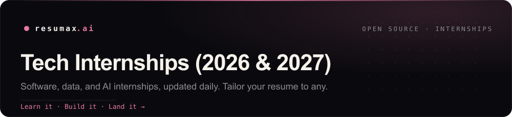

  

# Tech Internships (2026 & 2027)

Open software, data, AI/ML, security, and hardware **internships, co-ops, and working-student roles** for 2026 and 2027, refreshed daily and deduped across job boards. Every listing links into [ResuMax](https://resumax.ai/?utm_source=github&utm_medium=repo&utm_campaign=tech-internships&utm_content=intro), where **Atlas**, our AI career copilot, tailors your resume to it and preps you to ace the interview.

  

### Prepare a truthful, role-specific application.

**[Tailor your resume to any role above &rarr;](https://resumax.ai/?utm_source=github&utm_medium=repo&utm_campaign=tech-internships&utm_content=cta-link)**

Atlas compares the posting with your confirmed experience, prepares reviewable resume suggestions, and builds a focused coding, system-design, and behavioral interview plan. It never invents experience or submits an application for you.

**Found a role we're missing or a dead link?** [Open an issue](../../issues/new) and we'll fold it in.

## Open internships

**163** open, newest first.

🌐 Remote &nbsp;·&nbsp; 🆕 Posted this week

| Company | Role | Location | Apply | Tailor | Age |
|---|---|---|:--:|:--:|--:|
| **[Autonomous-teaming](https://resumax.ai/companies/autonomous-teaming?utm_source=github&utm_medium=repo&utm_campaign=tech-internships)** 🆕 | Robotics Software Engineer Intern – Swarm Systems (m/f/d) | Munich (DEU) | [Apply](https://www.arbeitnow.com/jobs/companies/autonomous-teaming/robotics-software-engineer-intern-swarm-systems-munich-deu-335725) |  | 3d |
| **[Trusteq Gmbh](https://resumax.ai/companies/trusteq-gmbh?utm_source=github&utm_medium=repo&utm_campaign=tech-internships)** 🆕 | Data Engineer Working Student (m/w/d) | Köln | [Apply](https://www.arbeitnow.com/jobs/companies/trusteq-gmbh/data-engineer-working-student-koln-276326) |  | 3d |
| **[Epicgames](https://resumax.ai/companies/epicgames?utm_source=github&utm_medium=repo&utm_campaign=tech-internships)** 🆕 | Web Engineer Intern | London | [Apply](https://www.arbeitnow.co.uk/jobs/companies/epicgames/web-engineer-intern-london-162230) |  | 3d |
| **[Capmo](https://resumax.ai/companies/capmo?utm_source=github&utm_medium=repo&utm_campaign=tech-internships)** 🆕 | Werkstudent Bauexperte für SaaS Software (m/w/d) | Munich | [Apply](https://www.arbeitnow.com/jobs/companies/capmo/werkstudent-bauexperte-fur-saas-software-munich-59760) |  | 3d |
| **[Christundcompany](https://resumax.ai/companies/christundcompany?utm_source=github&utm_medium=repo&utm_campaign=tech-internships)** 🆕 | Praktikum - Political Data Engineering (w/d/m) | Berlin | [Apply](https://www.arbeitnow.com/jobs/companies/christundcompany/praktikum-political-data-engineering-berlin-401525) |  | 3d |
| **[Northwoodspace](https://resumax.ai/companies/northwoodspace?utm_source=github&utm_medium=repo&utm_campaign=tech-internships)** 🆕 | Software Engineering Intern (2027 Summer Internship) | Torrance, CA | [Apply](https://jobs.ashbyhq.com/northwoodspace/ce3d4b73-461e-4128-a6f1-f933897e8119/application) |  | 3d |
| **[Trusteq Gmbh](https://resumax.ai/companies/trusteq-gmbh?utm_source=github&utm_medium=repo&utm_campaign=tech-internships)** 🆕 | Data Platform Engineer Working Student (m/w/d) | München | [Apply](https://www.arbeitnow.com/jobs/companies/trusteq-gmbh/data-platform-engineer-working-student-munchen-442846) |  | 3d |
| **[Northwoodspace](https://resumax.ai/companies/northwoodspace?utm_source=github&utm_medium=repo&utm_campaign=tech-internships)** 🆕 | Embedded Software Engineering Intern (2027 Summer Internship) | Torrance, CA | [Apply](https://jobs.ashbyhq.com/northwoodspace/d0cca9dd-ea90-4c3b-94b4-17761932d11c/application) |  | 3d |
| **[Stripe](https://resumax.ai/companies/stripe?utm_source=github&utm_medium=repo&utm_campaign=tech-internships)** 🆕 | Software Engineer, Intern (Summer) | Dublin | [Apply](https://stripe.com/jobs/search?gh_jid=8097801) |  | 3d |
| **[Xaira Therapeutics](https://resumax.ai/companies/xaira-therapeutics?utm_source=github&utm_medium=repo&utm_campaign=tech-internships)** 🆕 | AI Scientist Intern, Computational Protein Design | Seattle, Washington, United States; South San Francisco, California, United States | [Apply](https://job-boards.greenhouse.io/xairatherapeutics/jobs/5225658007) |  | 3d |
| **[Telus Digital](https://resumax.ai/companies/telus-digital?utm_source=github&utm_medium=repo&utm_campaign=tech-internships)** 🌐 🆕 | Software Engineering Intern (Brazil) - Year Round 2027 | Porto Alegre, Brazil | [Apply](https://jobs.ashbyhq.com/telus-digital/98495440-1a32-4c7e-8183-f38beebfd1d0/application) |  | 3d |
| **[Clera](https://resumax.ai/companies/clera?utm_source=github&utm_medium=repo&utm_campaign=tech-internships)** 🆕 | Founding Engineer Intern | San Francisco | [Apply](https://jobs.ashbyhq.com/clera/2b250324-b074-4cee-a482-26cca47915aa/application) |  | 4d |
| **[Drw](https://resumax.ai/companies/drw?utm_source=github&utm_medium=repo&utm_campaign=tech-internships)** 🆕 | Software Engineer Intern (Data Engineering) | Singapore | [Apply](https://job-boards.greenhouse.io/drweng/jobs/8127242) |  | 4d |
| **[Netcompany](https://resumax.ai/companies/netcompany?utm_source=github&utm_medium=repo&utm_campaign=tech-internships)** 🆕 | Internship for Bachelor of Engineering students, Operations &… | Copenhagen, dk | [Apply](https://jobs.smartrecruiters.com/netcompany1/744000146143059) |  | 4d |
| **[Bosch Group](https://resumax.ai/companies/bosch-group?utm_source=github&utm_medium=repo&utm_campaign=tech-internships)** 🆕 | [BD] OutSystems Developer Intern | Ha Noi, vn · Ho Chi Minh, vn | [Apply](https://jobs.smartrecruiters.com/boschgroup/744000146128839) |  | 4d |
| **[Western Digital](https://resumax.ai/companies/western-digital?utm_source=github&utm_medium=repo&utm_campaign=tech-internships)** 🆕 | Internship - Software Development (Embedded) | Petaling Jaya, Selangor, my | [Apply](https://jobs.smartrecruiters.com/westerndigital/744000146120720) |  | 4d |
| **[Stripe](https://resumax.ai/companies/stripe?utm_source=github&utm_medium=repo&utm_campaign=tech-internships)** 🆕 | Software Engineer, Intern | Bengaluru | [Apply](https://stripe.com/jobs/search?gh_jid=8031833) |  | 3d |
| **[Telus Digital](https://resumax.ai/companies/telus-digital?utm_source=github&utm_medium=repo&utm_campaign=tech-internships)** 🌐 🆕 | Software Engineering Intern (US) - Summer 2027 | Charlottesville | [Apply](https://jobs.ashbyhq.com/telus-digital/32ee6ede-d3cf-4827-b7af-f8d64f2bca11/application) |  | 3d |
| **[Meierhofer](https://resumax.ai/companies/meierhofer?utm_source=github&utm_medium=repo&utm_campaign=tech-internships)** 🌐 🆕 | Werkstudent Data Science / Business Intelligence (m/w/d) | Leipzig | [Apply](https://www.arbeitnow.com/jobs/companies/meierhofer/remote-werkstudent-data-science-business-intelligence-leipzig-182556) |  | 4d |
| **[Drw](https://resumax.ai/companies/drw?utm_source=github&utm_medium=repo&utm_campaign=tech-internships)** 🆕 | Quantitative Developer Intern (Python) | Singapore | [Apply](https://job-boards.greenhouse.io/drweng/jobs/7981754) |  | 5d |
| **[Autarcenergy](https://resumax.ai/companies/autarcenergy?utm_source=github&utm_medium=repo&utm_campaign=tech-internships)** 🆕 | Praktikum Software Vertrieb im Bereich Erneuerbare Energien | Berlin | [Apply](https://www.arbeitnow.com/jobs/companies/autarcenergy/praktikum-software-vertrieb-im-bereich-erneuerbare-energien-berlin-48664) |  | 5d |
| **[Arista Networks](https://resumax.ai/companies/arista-networks?utm_source=github&utm_medium=repo&utm_campaign=tech-internships)** 🌐 🆕 | Intern Software Engineers - C/C++ | Poland - Remote, pl | [Apply](https://jobs.smartrecruiters.com/aristanetworks/744000145998379) |  | 5d |
| **[Bosch Group](https://resumax.ai/companies/bosch-group?utm_source=github&utm_medium=repo&utm_campaign=tech-internships)** 🆕 | Mandatory Internship AI and Robotics | Stuttgart, BW, de | [Apply](https://jobs.smartrecruiters.com/boschgroup/744000145952899) |  | 5d |
| **[atvari GmbH](https://resumax.ai/companies/atvari-gmbh?utm_source=github&utm_medium=repo&utm_campaign=tech-internships)** 🌐 🆕 | Nix / NixOS Software Engineering Intern | Lüneburg | [Apply](https://www.arbeitnow.com/jobs/companies/atvari-gmbh/nix-nixos-software-engineering-intern-luneburg-113136) |  | 5d |
| **[Idealworks](https://resumax.ai/companies/idealworks?utm_source=github&utm_medium=repo&utm_campaign=tech-internships)** 🆕 | Working Student IT & Infrastructure (m/f/d) | München | [Apply](https://www.arbeitnow.com/jobs/companies/idealworks/working-student-it-infrastructure-munchen-41211) |  | 5d |
| **[Imtf](https://resumax.ai/companies/imtf?utm_source=github&utm_medium=repo&utm_campaign=tech-internships)** 🆕 | Working Student (m/w/d) - DevOps Support | Bensheim, Germany | [Apply](https://www.arbeitnow.com/jobs/companies/imtf/working-student-devops-support-bensheim-138004) |  | 5d |
| **[Meierhofer](https://resumax.ai/companies/meierhofer?utm_source=github&utm_medium=repo&utm_campaign=tech-internships)** 🌐 🆕 | Werkstudent Softwareentwicklung Schwerpunkt Security (m/w/d) | Leipzig | [Apply](https://www.arbeitnow.com/jobs/companies/meierhofer/remote-werkstudent-softwareentwicklung-schwerpunkt-security-leipzig-22829) |  | 4d |
| **[Drw](https://resumax.ai/companies/drw?utm_source=github&utm_medium=repo&utm_campaign=tech-internships)** 🆕 | Software Developer Intern (C++) | Singapore | [Apply](https://job-boards.greenhouse.io/drweng/jobs/8014910) |  | 5d |
| **[Bosch Group](https://resumax.ai/companies/bosch-group?utm_source=github&utm_medium=repo&utm_campaign=tech-internships)** 🆕 | [ETA] AI Engineer Intern (6-month fulltime Internship) | Tân Bình, Thành phố Hồ Chí Minh, vn | [Apply](https://jobs.smartrecruiters.com/boschgroup/744000145938529) |  | 5d |
| **[atvari GmbH](https://resumax.ai/companies/atvari-gmbh?utm_source=github&utm_medium=repo&utm_campaign=tech-internships)** 🌐 🆕 | DevOps Engineering Intern (Nix, NixOS, Rust) | Lüneburg | [Apply](https://www.arbeitnow.com/jobs/companies/atvari-gmbh/devops-engineering-intern-nix-nixos-rust-luneburg-437250) |  | 5d |
| **[Bosch Group](https://resumax.ai/companies/bosch-group?utm_source=github&utm_medium=repo&utm_campaign=tech-internships)** 🌐 🆕 | Pflichtpraktikum Data Engineering – CAD-Visualisierung | Renningen, BW, de | [Apply](https://jobs.smartrecruiters.com/boschgroup/744000145898759) |  | 5d |
| **[atvari GmbH](https://resumax.ai/companies/atvari-gmbh?utm_source=github&utm_medium=repo&utm_campaign=tech-internships)** 🌐 🆕 | Rust Software Engineering Intern | Lüneburg | [Apply](https://www.arbeitnow.com/jobs/companies/atvari-gmbh/rust-software-engineering-intern-luneburg-148823) |  | 5d |
| **[Isarsoft](https://resumax.ai/companies/isarsoft?utm_source=github&utm_medium=repo&utm_campaign=tech-internships)** 🆕 | Working Student Application Software Engineer | Munich | [Apply](https://www.arbeitnow.com/jobs/companies/isarsoft/working-student-application-software-engineer-munich-302019) |  | 5d |
| **[ilert GmbH](https://resumax.ai/companies/ilert-gmbh?utm_source=github&utm_medium=repo&utm_campaign=tech-internships)** 🆕 | Working Student / Intern: Offensive Security Engineer (Red Team… | Cologne | [Apply](https://www.arbeitnow.com/jobs/companies/ilert-gmbh/working-student-intern-offensive-security-engineer-red-team-appsec-cologne-335470) |  | 5d |
| **[SharkNinja](https://resumax.ai/companies/sharkninja?utm_source=github&utm_medium=repo&utm_campaign=tech-internships)** 🆕 | Fall 2026: Product Design Engineering Co-op, Ninja (September… | Needham, MA, United States | [Apply](https://job-boards.greenhouse.io/sharkninjaoperatingllc/jobs/4646375006) |  | 5d |
| **[Bosch Group](https://resumax.ai/companies/bosch-group?utm_source=github&utm_medium=repo&utm_campaign=tech-internships)** 🆕 | Phone as a Key Software Engineering - Intern | Plymouth, MI, us | [Apply](https://jobs.smartrecruiters.com/boschgroup/744000145785190) |  | 6d |
| **[Realmalliance](https://resumax.ai/companies/realmalliance?utm_source=github&utm_medium=repo&utm_campaign=tech-internships)** 🌐 🆕 | Software Engineer - Intern | Remote | [Apply](https://jobs.ashbyhq.com/realmalliance/a8a2f78e-1c28-4b52-a77a-c2b2ad9b7a8a/application) |  | 6d |
| **[Imc](https://resumax.ai/companies/imc?utm_source=github&utm_medium=repo&utm_campaign=tech-internships)** 🆕 | Machine Learning Research Intern - Summer 2027 - Amsterdam | Amsterdam, Netherlands | [Apply](https://job-boards.eu.greenhouse.io/imc/jobs/4912874101) |  | 6d |
| **[Simcon](https://resumax.ai/companies/simcon?utm_source=github&utm_medium=repo&utm_campaign=tech-internships)** 🌐 🆕 | Werkstudent:in Simulation & Application Engineering (m/w/d) | Deutschland Remote | [Apply](https://www.arbeitnow.com/jobs/companies/simcon/remote-werkstudentin-simulation-application-engineering-93133) |  | 6d |
| **[H2FLY GmbH](https://resumax.ai/companies/h2fly-gmbh?utm_source=github&utm_medium=repo&utm_campaign=tech-internships)** 🆕 | Intern / Working Student (all genders) Software / Full-Stack… | Stuttgart | [Apply](https://www.arbeitnow.com/jobs/companies/h2fly-gmbh/intern-working-student-all-genders-software-full-stack-development-stuttgart-183817) |  | 6d |
| **[AbbVie](https://resumax.ai/companies/abbvie?utm_source=github&utm_medium=repo&utm_campaign=tech-internships)** 🆕 | 2027 Business Technology Solutions Intern - Data & Software… | Irvine, CA, us · South San Francisco, CA, us | [Apply](https://jobs.smartrecruiters.com/abbvie/3743990014860391) |  | 6d |
| **[Viavi Solutions](https://resumax.ai/companies/viavi-solutions?utm_source=github&utm_medium=repo&utm_campaign=tech-internships)** 🆕 | Development Engineer Intern - Software Engineering/AI Track | Morrisville, NC | [Apply](https://viavisolutions.wd1.myworkdayjobs.com/careers/job/Morrisville-NC-USA/Early-Careers-Rotational-Program-Development-Engineer---Software-Engineering-AI-Track_260004987-1) |  | 6d |
| **[Bosch Group](https://resumax.ai/companies/bosch-group?utm_source=github&utm_medium=repo&utm_campaign=tech-internships)** 🆕 | Werkstudent Wissensmanagement inkl. LLM Integration für… | Stuttgart, BW, de | [Apply](https://jobs.smartrecruiters.com/boschgroup/744000145707829) |  | 6d |
| **[Imc](https://resumax.ai/companies/imc?utm_source=github&utm_medium=repo&utm_campaign=tech-internships)** 🆕 | Machine Learning Research Intern - Summer 2027 - Chicago | Chicago, United States | [Apply](https://job-boards.eu.greenhouse.io/imc/jobs/4907430101) |  | 6d |
| **[AbbVie](https://resumax.ai/companies/abbvie?utm_source=github&utm_medium=repo&utm_campaign=tech-internships)** 🆕 | 2027 Business Technology Solutions Intern - Cloud Engineering… | Irvine, CA, us +2 more | [Apply](https://jobs.smartrecruiters.com/abbvie/3743990014860456) |  | 6d |
| **[Bosch Group](https://resumax.ai/companies/bosch-group?utm_source=github&utm_medium=repo&utm_campaign=tech-internships)** 🆕 | [EBS] Embedded Engineer Intern (Matlab/Simulink) | Ho Chi Minh, vn | [Apply](https://jobs.smartrecruiters.com/boschgroup/744000145684890) |  | 6d |
| **[Imc](https://resumax.ai/companies/imc?utm_source=github&utm_medium=repo&utm_campaign=tech-internships)** 🆕 | Machine Learning Research Intern - Summer 2027 - Sydney | Sydney,  Australia | [Apply](https://job-boards.eu.greenhouse.io/imc/jobs/4956547101) |  | 6d |
| **[Bosch Group](https://resumax.ai/companies/bosch-group?utm_source=github&utm_medium=repo&utm_campaign=tech-internships)** 🆕 | [BSV] Embedded Test Engineer Intern (Matlab/Simulink) | Ho Chi Minh, vn | [Apply](https://jobs.smartrecruiters.com/boschgroup/744000145673389) |  | 6d |
| **[Zip](https://resumax.ai/companies/zip?utm_source=github&utm_medium=repo&utm_campaign=tech-internships)** 🌐 🆕 | Software Engineer Intern (Summer 2027) | San Francisco | [Apply](https://jobs.ashbyhq.com/zip/249837b3-106f-4751-a4f2-03a2c5df5faf/application) |  | 6d |
| **[Verkada](https://resumax.ai/companies/verkada?utm_source=github&utm_medium=repo&utm_campaign=tech-internships)** 🆕 | Mobile Software Engineering Intern 2027 | San Mateo, CA United States | [Apply](https://job-boards.greenhouse.io/verkada/jobs/5219131007) |  | 6d |
| **[Holzland Becker](https://resumax.ai/companies/holzland-becker?utm_source=github&utm_medium=repo&utm_campaign=tech-internships)** 🆕 | Werkstudent (w/m/d) Software Development | Offenbach am Main, Hessen, Deutschland | [Apply](https://www.arbeitnow.com/jobs/companies/holzland-becker/werkstudent-software-development-offenbach-am-main-496184) |  | 6d |
| **[Epicgames](https://resumax.ai/companies/epicgames?utm_source=github&utm_medium=repo&utm_campaign=tech-internships)** | Machine Learning Intern | London | [Apply](https://www.arbeitnow.co.uk/jobs/companies/epicgames/machine-learning-intern-london-377216) |  | 7d |
| **[Sia](https://resumax.ai/companies/sia?utm_source=github&utm_medium=repo&utm_campaign=tech-internships)** | Final year internship - Marketing Data Scientist | Paris, IDF, fr | [Apply](https://jobs.smartrecruiters.com/sia/744000145545719) |  | 7d |
| **[Titanom Technologies](https://resumax.ai/companies/titanom-technologies?utm_source=github&utm_medium=repo&utm_campaign=tech-internships)** | Werkstudent Software Testing (all genders) | Germering, Germany | [Apply](https://www.arbeitnow.com/jobs/companies/titanom-technologies/werkstudent-software-testing-all-genders-germering-248657) |  | 7d |
| **[functionHR GmbH](https://resumax.ai/companies/functionhr-gmbh?utm_source=github&utm_medium=repo&utm_campaign=tech-internships)** 🌐 | Werkstudent Software-Testing (m/w/d) | Munich | [Apply](https://www.arbeitnow.com/jobs/companies/functionhr-gmbh/werkstudent-software-testing-munich-437385) |  | 7d |
| **[leasyro GmbH](https://resumax.ai/companies/leasyro-gmbh?utm_source=github&utm_medium=repo&utm_campaign=tech-internships)** | Software Developer (m/w/d) \| Festanstellung & Werkstudent | Berlin | [Apply](https://www.arbeitnow.com/jobs/companies/leasyro-gmbh/software-developer-festanstellung-werkstudent-berlin-403295) |  | 7d |
| **[KENBUN IT AG](https://resumax.ai/companies/kenbun-it-ag?utm_source=github&utm_medium=repo&utm_campaign=tech-internships)** 🌐 | Werkstudent*in (w/m/d) - Data Science & Deep-Learning im… | Karlsruhe | [Apply](https://www.arbeitnow.com/jobs/companies/kenbun-it-ag/werkstudentin-data-science-deep-learning-im-kontext-sprachassistenzsysteme-karlsruhe-oder-remote-173151) |  | 7d |
| **[SharkNinja](https://resumax.ai/companies/sharkninja?utm_source=github&utm_medium=repo&utm_campaign=tech-internships)** | Fall 2026: Product Design Engineering Co-op, Advanced… | Needham, MA, United States | [Apply](https://job-boards.greenhouse.io/sharkninjaoperatingllc/jobs/4646272006) |  | 7d |
| **[Freeform](https://resumax.ai/companies/freeform?utm_source=github&utm_medium=repo&utm_campaign=tech-internships)** | Software Engineering Intern (Summer 2027) | Los Angeles, CA (On-site) | [Apply](https://job-boards.greenhouse.io/freeformfuturecorp/jobs/7872198003) |  | 7d |
| **[Renesas Electronics](https://resumax.ai/companies/renesas-electronics?utm_source=github&utm_medium=repo&utm_campaign=tech-internships)** | Intern - Analog Design Engineer | Seongnam-si, Gyeonggi-do, kr | [Apply](https://jobs.smartrecruiters.com/renesaselectronics/744000145410040) |  | 7d |
| **[Cox Automotive](https://resumax.ai/companies/cox-automotive?utm_source=github&utm_medium=repo&utm_campaign=tech-internships)** | Software Engineer Intern | Burlington, VT | [Apply](https://cox.wd1.myworkdayjobs.com/Cox_External_Career_Site_1/job/Burlington-VT/Entry-Level-Software-Engineer--Burlington--VT-_R202681784) |  | 7d |
| **[Verkada](https://resumax.ai/companies/verkada?utm_source=github&utm_medium=repo&utm_campaign=tech-internships)** 🆕 | Security Software Engineering Intern 2027 | San Mateo, CA United States | [Apply](https://job-boards.greenhouse.io/verkada/jobs/5213881007) |  | 6d |
| **[Sia](https://resumax.ai/companies/sia?utm_source=github&utm_medium=repo&utm_campaign=tech-internships)** | Final year internship - Data Scientist & AI Consultant | Paris, IDF, fr | [Apply](https://jobs.smartrecruiters.com/sia/744000145544719) |  | 7d |
| **[Verkada](https://resumax.ai/companies/verkada?utm_source=github&utm_medium=repo&utm_campaign=tech-internships)** 🆕 | Frontend Software Engineering Intern 2027 | San Mateo, CA United States | [Apply](https://job-boards.greenhouse.io/verkada/jobs/5210942007) |  | 6d |
| **[Verkada](https://resumax.ai/companies/verkada?utm_source=github&utm_medium=repo&utm_campaign=tech-internships)** 🆕 | Embedded Software Engineering Intern 2027 | San Mateo, CA United States | [Apply](https://job-boards.greenhouse.io/verkada/jobs/5211595007) |  | 6d |
| **[Verkada](https://resumax.ai/companies/verkada?utm_source=github&utm_medium=repo&utm_campaign=tech-internships)** 🆕 | Backend Software Engineering Intern 2027 | San Mateo, CA United States | [Apply](https://job-boards.greenhouse.io/verkada/jobs/5210813007) |  | 6d |
| **[Intuitive](https://resumax.ai/companies/intuitive?utm_source=github&utm_medium=repo&utm_campaign=tech-internships)** | Computer Vision Engineering Intern - Fall 2026 | Sunnyvale, CA, us | [Apply](https://jobs.smartrecruiters.com/intuitive/744000145329669) |  | 8d |
| **[Phlair](https://resumax.ai/companies/phlair?utm_source=github&utm_medium=repo&utm_campaign=tech-internships)** | Working Student / Intern – Control Team (Systems & Data… | München | [Apply](https://www.arbeitnow.com/jobs/companies/phlair/working-student-intern-control-team-systems-data-infrastructure-munchen-252125) |  | 8d |
| **[321 MED GmbH](https://resumax.ai/companies/321-med-gmbh?utm_source=github&utm_medium=repo&utm_campaign=tech-internships)** | Werkstudent (m/w/d) Software Testing / Qualitätssicherung… | Munich | [Apply](https://www.arbeitnow.com/jobs/companies/321-med-gmbh/werkstudent-software-testing-qualitatssicherung-munchen-munich-379163) |  | 8d |
| **[Pennsylvania State University](https://resumax.ai/companies/pennsylvania-state-university?utm_source=github&utm_medium=repo&utm_campaign=tech-internships)** | Operations Research Engineer Intern - Undersea Systems | State College, PA | [Apply](https://psu.wd1.myworkdayjobs.com/PSU_Staff/job/Penn-State-University-Park/Operations-Research-Undersea-Systems-Analyst_REQ_0000081646-1) |  | 8d |
| **[TYTAN Technologies GmbH](https://resumax.ai/companies/tytan-technologies-gmbh?utm_source=github&utm_medium=repo&utm_campaign=tech-internships)** | Unsolicited Application: Working Student - Software Engineering… | Munich, Bayern, Germany | [Apply](https://www.arbeitnow.com/jobs/companies/tytan-technologies-gmbh/unsolicited-application-working-student-software-engineering-munich-98564) |  | 8d |
| **[Optiverus](https://resumax.ai/companies/optiverus?utm_source=github&utm_medium=repo&utm_campaign=tech-internships)** | Software Engineer Internship (2027 Start) | London | [Apply](https://www.arbeitnow.co.uk/jobs/companies/optiverus/software-engineer-internship-2027-start-london-473646) |  | 9d |
| **[Samsara](https://resumax.ai/companies/samsara?utm_source=github&utm_medium=repo&utm_campaign=tech-internships)** | Software Engineering Internship - London | London - UK2 | [Apply](https://www.samsara.com/company/careers/roles/8082093?gh_jid=8082093) |  | 9d |
| **[Databricks](https://resumax.ai/companies/databricks?utm_source=github&utm_medium=repo&utm_campaign=tech-internships)** | Software Engineering Intern (2027 Start) - Winter | Bellevue, Washington; Mountain View, California; San Francisco, California | [Apply](https://databricks.com/company/careers/open-positions/job?gh_jid=8732364002) |  | 10d |
| **[Toshiba Global Commerce Solutions - External](https://resumax.ai/companies/toshiba-global-commerce-solutions-external?utm_source=github&utm_medium=repo&utm_campaign=tech-internships)** | AI Software Engineering Intern | Durham, NC | [Apply](https://job-boards.greenhouse.io/toshibaglobalcommercesolutions/jobs/5214224007) |  | 10d |
| **[Bosch Group](https://resumax.ai/companies/bosch-group?utm_source=github&utm_medium=repo&utm_campaign=tech-internships)** | Working Student in Embedded Software Development - High Level | Cluj-Napoca, CJ, ro | [Apply](https://jobs.smartrecruiters.com/boschgroup/744000144766999) |  | 11d |
| **[Llnl](https://resumax.ai/companies/llnl?utm_source=github&utm_medium=repo&utm_campaign=tech-internships)** | National Security Engineering Division (NSED) Undergraduate… | Livermore, CA, us | [Apply](https://jobs.smartrecruiters.com/llnl/3743990014731656) |  | 11d |
| **[Llnl](https://resumax.ai/companies/llnl?utm_source=github&utm_medium=repo&utm_campaign=tech-internships)** | National Security Engineering Division (NSED) Graduate Intern -… | Livermore, CA, us | [Apply](https://jobs.smartrecruiters.com/llnl/3743990014731646) |  | 11d |
| **[Imc](https://resumax.ai/companies/imc?utm_source=github&utm_medium=repo&utm_campaign=tech-internships)** | Software Engineer Intern - Summer 2027 | Chicago, United States | [Apply](https://job-boards.eu.greenhouse.io/imc/jobs/4823924101) |  | 11d |
| **[Samsara](https://resumax.ai/companies/samsara?utm_source=github&utm_medium=repo&utm_campaign=tech-internships)** | Software Engineering Internship - San Francisco | San Francisco - SF9 | [Apply](https://www.samsara.com/company/careers/roles/8082091?gh_jid=8082091) |  | 11d |
| **[Notion](https://resumax.ai/companies/notion?utm_source=github&utm_medium=repo&utm_campaign=tech-internships)** 🌐 | Data Science Intern (Winter 2027) | San Francisco, California | [Apply](https://jobs.ashbyhq.com/notion/a67d6f2b-7c13-41d0-b36b-b2f662c9873e/application) |  | 12d |
| **[Anduril Industries](https://resumax.ai/companies/anduril-industries?utm_source=github&utm_medium=repo&utm_campaign=tech-internships)** | 2027 Software Engineer Intern | Atlanta, Georgia, United States; Boston, Massachusetts, United States; Broomfield, Colorado, United States; Colorado Springs, Colorado, United States; Costa Mesa, California, United States; Fort Collins, Colorado, United States; Irvine, California, United States; Reston, Virginia, United States; Seattle, Washington, United States | [Apply](https://boards.greenhouse.io/andurilindustries/jobs/5148079007?gh_jid=5148079007) |  | 12d |
| **[Drw](https://resumax.ai/companies/drw?utm_source=github&utm_medium=repo&utm_campaign=tech-internships)** | AI/ML Research Intern | Montreal | [Apply](https://job-boards.greenhouse.io/drweng/jobs/7991171) |  | 12d |
| **[BSI Software](https://resumax.ai/companies/bsi-software?utm_source=github&utm_medium=repo&utm_campaign=tech-internships)** | Werkstudent Software Engineering (all genders) DE | Darmstadt, Hessen, Deutschland | [Apply](https://www.arbeitnow.com/jobs/companies/bsi-software/werkstudent-software-engineering-all-genders-de-darmstadt-69987) |  | 13d |
| **[Wabtec](https://resumax.ai/companies/wabtec?utm_source=github&utm_medium=repo&utm_campaign=tech-internships)** | Werkstudent – Methods (Software) (m/w/d) | Munich, BA, de | [Apply](https://jobs.smartrecruiters.com/wabtec/3743990014667926) |  | 13d |
| **[World of VR](https://resumax.ai/companies/world-of-vr?utm_source=github&utm_medium=repo&utm_campaign=tech-internships)** | Robotics Engineer Humanoids (Software & AI) - Werkstudent… | Cologne | [Apply](https://www.arbeitnow.com/jobs/companies/world-of-vr/robotics-engineer-humanoids-software-ai-werkstudent-cologne-17415) |  | 13d |
| **[Imc](https://resumax.ai/companies/imc?utm_source=github&utm_medium=repo&utm_campaign=tech-internships)** | Software Engineer Intern 2027 | Hong Kong, Hong Kong | [Apply](https://job-boards.eu.greenhouse.io/imc/jobs/4941206101) |  | 13d |
| **[Kumi Health Gmbh](https://resumax.ai/companies/kumi-health-gmbh?utm_source=github&utm_medium=repo&utm_campaign=tech-internships)** | Werkstudent:in Softwareentwicklung & IT-Support (Digital Health… | Hamburg | [Apply](https://www.arbeitnow.com/jobs/companies/kumi-health-gmbh/werkstudentin-softwareentwicklung-it-support-digital-health-medizin-all-genders-hamburg-34066) |  | 13d |
| **[Drw](https://resumax.ai/companies/drw?utm_source=github&utm_medium=repo&utm_campaign=tech-internships)** | Platform Engineer Intern | Chicago | [Apply](https://job-boards.greenhouse.io/drweng/jobs/7997729) |  | 12d |
| **[Sia](https://resumax.ai/companies/sia?utm_source=github&utm_medium=repo&utm_campaign=tech-internships)** | Final year internship - DevOps / Platform Engineer | Paris, IDF, fr | [Apply](https://jobs.smartrecruiters.com/sia/744000144097659) |  | 14d |
| **[Agile Robots SE - Personio](https://resumax.ai/companies/agile-robots-se-personio?utm_source=github&utm_medium=repo&utm_campaign=tech-internships)** | Intern (m/f/d) Vision Software Development | Germany, Munich (HQ) | [Apply](https://www.arbeitnow.com/jobs/companies/agile-robots-se-personio/intern-vision-software-development-germany-munich-hq-401898) |  | 14d |
| **[Bosch Group](https://resumax.ai/companies/bosch-group?utm_source=github&utm_medium=repo&utm_campaign=tech-internships)** | [EAF] AI Engineer Intern (6-month fulltime Internship) | Thành phố Hồ Chí Minh, Hồ Chí Minh, vn | [Apply](https://jobs.smartrecruiters.com/boschgroup/744000143977589) |  | 14d |
| **[NOW GmbH Nationale Organisation für den Wandel in der ...](https://resumax.ai/companies/now-gmbh-nationale-organisation-f-r-den-wandel-in-der?utm_source=github&utm_medium=repo&utm_campaign=tech-internships)** | Werkstudent*in Data Science & KI | Berlin Fasanenstrasse | [Apply](https://www.arbeitnow.com/jobs/companies/now-gmbh-nationale-organisation-fur-den-wandel-in-der/werkstudentin-data-science-ki-berlin-fasanenstrasse-168604) |  | 14d |
| **[Renesas Electronics](https://resumax.ai/companies/renesas-electronics?utm_source=github&utm_medium=repo&utm_campaign=tech-internships)** | Digital Design Engineer Intern | Duluth, GEORGIA, us | [Apply](https://jobs.smartrecruiters.com/renesaselectronics/744000143930119) |  | 14d |
| **[Wabtec](https://resumax.ai/companies/wabtec?utm_source=github&utm_medium=repo&utm_campaign=tech-internships)** | Firmware Engineering Co-Op | Waltham, MA, us | [Apply](https://jobs.smartrecruiters.com/wabtec/3743990014629016) |  | 14d |
| **[Tri](https://resumax.ai/companies/tri?utm_source=github&utm_medium=repo&utm_campaign=tech-internships)** | Robotics Research Intern - Post-Training | Los Altos, CA | [Apply](https://jobs.lever.co/tri/186808f9-464c-4f22-9d7d-4372ef272ff0/apply) |  | 15d |
| **[Crewmeister](https://resumax.ai/companies/crewmeister?utm_source=github&utm_medium=repo&utm_campaign=tech-internships)** | DevOps Software Engineer Intern (Enrolled Students Only) (m/f/d) | Munich | [Apply](https://www.arbeitnow.com/jobs/companies/crewmeister/devops-software-engineer-intern-enrolled-students-only-munich-42883) |  | 15d |
| **[energized& Company GmbH](https://resumax.ai/companies/energized-and-company-gmbh?utm_source=github&utm_medium=repo&utm_campaign=tech-internships)** | Praktikant AI Engineer (m/w/d) | Munich | [Apply](https://www.arbeitnow.com/jobs/companies/energized-company-gmbh/praktikant-ai-engineer-munich-370373) |  | 15d |
| **[bitaggregat GmbH](https://resumax.ai/companies/bitaggregat-gmbh?utm_source=github&utm_medium=repo&utm_campaign=tech-internships)** | Werkstudent AI Consulting & Infrastructure (m/w/d) | Leipzig | [Apply](https://www.arbeitnow.com/jobs/companies/bitaggregat-gmbh/werkstudent-ai-consulting-infrastructure-leipzig-361351) |  | 15d |
| **[Replit](https://resumax.ai/companies/replit?utm_source=github&utm_medium=repo&utm_campaign=tech-internships)** 🌐 | Software Engineering Intern (Summer 2027) | Foster City, CA | [Apply](https://jobs.ashbyhq.com/replit/7e0dafe8-3eec-442e-aa76-a4d84d779fb1/application) |  | 16d |
| **[WeRide](https://resumax.ai/companies/weride?utm_source=github&utm_medium=repo&utm_campaign=tech-internships)** | Software Engineer Intern - Perception/Computer Vision | San Jose, CA | [Apply](https://jobs.lever.co/weride/5cde0d09-ba2d-408d-947e-4a42028cd4f7/apply) |  | 17d |
| **[Voleon](https://resumax.ai/companies/voleon?utm_source=github&utm_medium=repo&utm_campaign=tech-internships)** 🌐 | Software Engineer Intern - (Summer 2027) | Berkeley, CA | [Apply](https://jobs.ashbyhq.com/voleon/57f1b666-2f4b-4bad-aac0-fa42a1c8fdf6/application) |  | 17d |
| **[Notion](https://resumax.ai/companies/notion?utm_source=github&utm_medium=repo&utm_campaign=tech-internships)** 🌐 | Software Engineer Intern (Summer 2027) | San Francisco, California | [Apply](https://jobs.ashbyhq.com/notion/3fba1c39-c5cb-47d7-9ad2-1cec4d7e9d0c/application) |  | 17d |
| **[Drw](https://resumax.ai/companies/drw?utm_source=github&utm_medium=repo&utm_campaign=tech-internships)** | Software Developer Intern | Amsterdam +3 more | [Apply](https://job-boards.greenhouse.io/drweng/jobs/8020364) |  | 18d |
| **[Planet](https://resumax.ai/companies/planet?utm_source=github&utm_medium=repo&utm_campaign=tech-internships)** | Working Student, Software Engineering | Ljubljana, Slovenia | [Apply](https://job-boards.greenhouse.io/planetlabs/jobs/8011312) |  | 18d |
| **[Fifty-five](https://resumax.ai/companies/fifty-five?utm_source=github&utm_medium=repo&utm_campaign=tech-internships)** | Data Science Consultant Intern (H/F) | — | [Apply](https://apply.workable.com/j/D8F4443694/apply) |  | 18d |
| **[Notion](https://resumax.ai/companies/notion?utm_source=github&utm_medium=repo&utm_campaign=tech-internships)** 🌐 | Software Engineer Intern (Winter 2027) | San Francisco, California | [Apply](https://jobs.ashbyhq.com/notion/e66c6658-9e65-4c58-8db2-844628b6e8f8/application) |  | 17d |
| **[Field Ai](https://resumax.ai/companies/field-ai?utm_source=github&utm_medium=repo&utm_campaign=tech-internships)** | Electrical Engineer, Robotics Hardware- Part-time Internship | Irvine, CA | [Apply](https://jobs.lever.co/field-ai/1049e3e1-b4ca-4996-96a5-14e933f35b44/apply) |  | 18d |
| **[Appian Corporation](https://resumax.ai/companies/appian-corporation?utm_source=github&utm_medium=repo&utm_campaign=tech-internships)** | Information Security Engineer Intern | McLean, Virginia | [Apply](https://job-boards.greenhouse.io/appian/jobs/8088496) |  | 18d |
| **[Astranis](https://resumax.ai/companies/astranis?utm_source=github&utm_medium=repo&utm_campaign=tech-internships)** | Embedded Software Developer, Network/Payload Software Intern… | San Francisco | [Apply](https://job-boards.greenhouse.io/astranis/jobs/4601135006) |  | 18d |
| **[Imc](https://resumax.ai/companies/imc?utm_source=github&utm_medium=repo&utm_campaign=tech-internships)** | Software Engineer Intern | Amsterdam, Netherlands | [Apply](https://job-boards.eu.greenhouse.io/imc/jobs/4667854101) |  | 19d |
| **[Appian Corporation](https://resumax.ai/companies/appian-corporation?utm_source=github&utm_medium=repo&utm_campaign=tech-internships)** | Software Engineering Intern | McLean, Virginia | [Apply](https://job-boards.greenhouse.io/appian/jobs/8041237) |  | 18d |
| **[Astranis](https://resumax.ai/companies/astranis?utm_source=github&utm_medium=repo&utm_campaign=tech-internships)** | Flight Software Intern (Fall 2026) | San Francisco | [Apply](https://job-boards.greenhouse.io/astranis/jobs/4619283006) |  | 18d |
| **[Astranis](https://resumax.ai/companies/astranis?utm_source=github&utm_medium=repo&utm_campaign=tech-internships)** | Software Engineer- Backend Intern (Fall 2026) | San Francisco, CA | [Apply](https://job-boards.greenhouse.io/astranis/jobs/4681183006) |  | 18d |
| **[Astranis](https://resumax.ai/companies/astranis?utm_source=github&utm_medium=repo&utm_campaign=tech-internships)** | Software Engineer Intern - Enterprise Systems (Fall 2026) | San Francisco, CA | [Apply](https://job-boards.greenhouse.io/astranis/jobs/4699071006) |  | 18d |
| **[Western Digital](https://resumax.ai/companies/western-digital?utm_source=github&utm_medium=repo&utm_campaign=tech-internships)** | Summer 2027 Intern - Software Engineering | San Jose, CA, us | [Apply](https://jobs.smartrecruiters.com/westerndigital/744000143171017) |  | 19d |
| **[The New York Times](https://resumax.ai/companies/the-new-york-times?utm_source=github&utm_medium=repo&utm_campaign=tech-internships)** | Software Engineer, Scoop Core | New York, NY | [Apply](https://job-boards.greenhouse.io/thenewyorktimes/jobs/4673616005) |  | 20d |
| **[TMEIC Corporation Americas](https://resumax.ai/companies/tmeic-corporation-americas?utm_source=github&utm_medium=repo&utm_campaign=tech-internships)** | Intern - Applications, AI and Machine Learning (Spring 2027)… | — | [Apply](https://apply.workable.com/j/6FDBF2FD32/apply) |  | 20d |
| **[Zip](https://resumax.ai/companies/zip?utm_source=github&utm_medium=repo&utm_campaign=tech-internships)** 🌐 | Software Engineer Intern (Winter 2027) | Toronto | [Apply](https://jobs.ashbyhq.com/zip/2bc7327b-1c06-418a-beeb-bec1dd70480e/application) |  | 20d |
| **[DV Trading](https://resumax.ai/companies/dv-trading?utm_source=github&utm_medium=repo&utm_campaign=tech-internships)** | Software Engineer Intern - Summer 2027 (DV Commodities) | London · New York | [Apply](https://job-boards.greenhouse.io/dvtrading/jobs/4719125005) |  | 21d |
| **[Palantir](https://resumax.ai/companies/palantir?utm_source=github&utm_medium=repo&utm_campaign=tech-internships)** | Forward Deployed Software Engineer, Internship - Commercial | Chicago, IL · Seoul, South Korea | [Apply](https://jobs.lever.co/palantir/2ad0ab10-34c3-410d-883b-8052864a95cd/apply) |  | 22d |
| **[Imc](https://resumax.ai/companies/imc?utm_source=github&utm_medium=repo&utm_campaign=tech-internships)** | Hardware Machine Learning PhD Research Internship | Chicago, United States | [Apply](https://job-boards.eu.greenhouse.io/imc/jobs/4829785101) |  | 22d |
| **[Field Ai](https://resumax.ai/companies/field-ai?utm_source=github&utm_medium=repo&utm_campaign=tech-internships)** | Mechanical Engineer, Robotics Hardware - Part-Time Internship | Irvine, CA | [Apply](https://jobs.lever.co/field-ai/88f05d6e-ee93-4fc5-80cd-efe6854e22bc/apply) |  | 22d |
| **[RRS Group](https://resumax.ai/companies/rrs-group?utm_source=github&utm_medium=repo&utm_campaign=tech-internships)** 🌐 | 2027 Software Engineer Intern - Placement Year | San Francisco, xx | [Apply](https://jobs.smartrecruiters.com/rrsgroup/744000142513209) |  | 23d |
| **[CTC Campus - Website](https://resumax.ai/companies/ctc-campus-website?utm_source=github&utm_medium=repo&utm_campaign=tech-internships)** | Software Engineering Internship - Summer 2027 | Chicago, Illinois, United States | [Apply](https://job-boards.greenhouse.io/chicagotradingcampus/jobs/4716932005) |  | 24d |
| **[CTC Campus - External, Not Advertised](https://resumax.ai/companies/ctc-campus-external-not-advertised?utm_source=github&utm_medium=repo&utm_campaign=tech-internships)** | Software Engineering Internship - Summer 2027 | Chicago, Illinois, United States | [Apply](https://job-boards.greenhouse.io/ctccampusboard/jobs/4708230005) |  | 24d |
| **[Western Digital](https://resumax.ai/companies/western-digital?utm_source=github&utm_medium=repo&utm_campaign=tech-internships)** | Internship - Software Engineering | Petaling Jaya, Selangor, my | [Apply](https://jobs.smartrecruiters.com/westerndigital/744000142050119) |  | 25d |
| **[Rocket Lab Corporation](https://resumax.ai/companies/rocket-lab-corporation?utm_source=github&utm_medium=repo&utm_campaign=tech-internships)** | Launch Safety Software Intern | Auckland, NZ | [Apply](https://job-boards.greenhouse.io/rocketlab/jobs/7827254003) |  | 25d |
| **[Ubisoft](https://resumax.ai/companies/ubisoft?utm_source=github&utm_medium=repo&utm_campaign=tech-internships)** | [Internship] - R&D Developer Assistant - Neural Rendering for… | Bordeaux, Nouvelle-Aquitaine, fr | [Apply](https://jobs.smartrecruiters.com/ubisoft2/744000141951544) |  | 26d |
| **[Western Digital](https://resumax.ai/companies/western-digital?utm_source=github&utm_medium=repo&utm_campaign=tech-internships)** | Intern, Firmware Engineering | Petaling Jaya, Selangor, my | [Apply](https://jobs.smartrecruiters.com/westerndigital/744000141840819) |  | 26d |
| **[Snowflake](https://resumax.ai/companies/snowflake?utm_source=github&utm_medium=repo&utm_campaign=tech-internships)** | Software Engineer Intern - Warsaw Security | PL-Warsaw-Lixa C | [Apply](https://jobs.ashbyhq.com/snowflake/fc1923c1-b151-4458-a792-40d58331a5be/application) |  | 27d |
| **[Plus 2](https://resumax.ai/companies/plus-2?utm_source=github&utm_medium=repo&utm_campaign=tech-internships)** | Deep Learning Research Intern — Multimodal BEV Perception | Santa Clara, CA | [Apply](https://jobs.lever.co/plus-2/2ee24f85-bfa1-47fc-bfe3-fd07521a7b62/apply) |  | 28d |
| **[Belvederetrading](https://resumax.ai/companies/belvederetrading?utm_source=github&utm_medium=repo&utm_campaign=tech-internships)** | Software Engineer Intern - Summer 2027 | Chicago, Illinois | [Apply](https://jobs.lever.co/belvederetrading/10746b3d-1760-4573-9b63-b93f5a5e4fc0/apply) |  | 28d |
| **[Rocket Lab Corporation](https://resumax.ai/companies/rocket-lab-corporation?utm_source=github&utm_medium=repo&utm_campaign=tech-internships)** | Software Engineering Intern - Production Automation | Auckland, NZ | [Apply](https://job-boards.greenhouse.io/rocketlab/jobs/7819677003) |  | 28d |
| **[Western Digital](https://resumax.ai/companies/western-digital?utm_source=github&utm_medium=repo&utm_campaign=tech-internships)** | Intern - Data Science | Bayan Lepas, Penang, my | [Apply](https://jobs.smartrecruiters.com/westerndigital/744000141229015) |  | 29d |
| **[Rocket Lab Corporation](https://resumax.ai/companies/rocket-lab-corporation?utm_source=github&utm_medium=repo&utm_campaign=tech-internships)** | Flight Analysis Intern - Software | Auckland, NZ | [Apply](https://job-boards.greenhouse.io/rocketlab/jobs/7819877003) |  | 29d |
| **[Rocket Lab Corporation](https://resumax.ai/companies/rocket-lab-corporation?utm_source=github&utm_medium=repo&utm_campaign=tech-internships)** | Flight Software Intern - Neutron | Auckland, NZ | [Apply](https://job-boards.greenhouse.io/rocketlab/jobs/7819872003) |  | 29d |
| **[Tomra](https://resumax.ai/companies/tomra?utm_source=github&utm_medium=repo&utm_campaign=tech-internships)** | Software Engineering Intern - Summer 2026 - 2027 | Auckland, Auckland, nz | [Apply](https://jobs.smartrecruiters.com/tomra/744000140791239) |  | 32d |
| **[Flexion Robotics](https://resumax.ai/companies/flexion-robotics?utm_source=github&utm_medium=repo&utm_campaign=tech-internships)** | Robotics Engineering Intern - Mechatronic Design | — | [Apply](https://apply.workable.com/j/75F6594B5D/apply) |  | 33d |
| **[Flexion Robotics](https://resumax.ai/companies/flexion-robotics?utm_source=github&utm_medium=repo&utm_campaign=tech-internships)** | Robotics Engineering Intern - Testing | — | [Apply](https://apply.workable.com/j/9FDA4ADC0B/apply) |  | 33d |
| **[Modal](https://resumax.ai/companies/modal?utm_source=github&utm_medium=repo&utm_campaign=tech-internships)** | ML Research Intern | New York | [Apply](https://jobs.ashbyhq.com/modal/38888294-6bc7-4dab-b072-6d0f0c2ed79a/application) |  | 34d |
| **[Skydio](https://resumax.ai/companies/skydio?utm_source=github&utm_medium=repo&utm_campaign=tech-internships)** 🌐 | Product Design Engineer Intern | San Mateo, California, United States | [Apply](https://jobs.ashbyhq.com/skydio/ce482813-99c2-4eaa-a165-2ed201249182/application) |  | 34d |
| **[Getwingapp](https://resumax.ai/companies/getwingapp?utm_source=github&utm_medium=repo&utm_campaign=tech-internships)** | AI & Tech Internship Program (Software, Product, Ops, GTM) | Beijing +3 more | [Apply](https://jobs.lever.co/getwingapp/7cca4ddf-6fbd-4789-bdbb-eb472eeaaf7c/apply) |  | 39d |
| **[Pony. AI](https://resumax.ai/companies/pony-ai?utm_source=github&utm_medium=repo&utm_campaign=tech-internships)** | Research Intern - Deep Learning | — | [Apply](https://apply.workable.com/j/4C1F53EF5D/apply) |  | 41d |
| **[Pony. AI](https://resumax.ai/companies/pony-ai?utm_source=github&utm_medium=repo&utm_campaign=tech-internships)** | Software Engineer Intern - Generalist | — | [Apply](https://apply.workable.com/j/BA5FFDBC71/apply) |  | 41d |
| **[Shyftlabs](https://resumax.ai/companies/shyftlabs?utm_source=github&utm_medium=repo&utm_campaign=tech-internships)** | AI Engineer Intern | Toronto, Ontario | [Apply](https://jobs.lever.co/shyftlabs/4f389ea7-9b98-4ed0-99c2-b25ea8cc2dcd/apply) |  | 41d |
| **[Thinkahead](https://resumax.ai/companies/thinkahead?utm_source=github&utm_medium=repo&utm_campaign=tech-internships)** | MS Infrastructure Intern (6 months) | Gurugram, Haryana | [Apply](https://jobs.lever.co/thinkahead/76649f02-c9df-4206-a365-cf9d33350b55/apply) |  | 42d |
| **[Five Rings LLC - Careers](https://resumax.ai/companies/five-rings-llc-careers?utm_source=github&utm_medium=repo&utm_campaign=tech-internships)** | Summer Intern 2027 - Software Developer | New York | [Apply](https://job-boards.greenhouse.io/fiveringsllc/jobs/5349707008) |  | 42d |
| **[Faire](https://resumax.ai/companies/faire?utm_source=github&utm_medium=repo&utm_campaign=tech-internships)** | Data Science Intern | San Francisco, CA | [Apply](https://boards.greenhouse.io/faire/jobs/8376377002?gh_jid=8376377002) |  | 42d |
| **[Fifty-five](https://resumax.ai/companies/fifty-five?utm_source=github&utm_medium=repo&utm_campaign=tech-internships)** | Data & AI Engineer Intern (H/F) | — | [Apply](https://apply.workable.com/j/2807A639B7/apply) |  | 43d |
| **[Gumloop](https://resumax.ai/companies/gumloop?utm_source=github&utm_medium=repo&utm_campaign=tech-internships)** | Design Engineer Intern | San Francisco Office | [Apply](https://jobs.ashbyhq.com/gumloop/dcdc0658-b3fd-44cd-b0cf-4016c9513d40/application) |  | 46d |
| **[Palantir](https://resumax.ai/companies/palantir?utm_source=github&utm_medium=repo&utm_campaign=tech-internships)** | Forward Deployed Software Engineer, Internship - Intel | Washington, D.C. | [Apply](https://jobs.lever.co/palantir/9e40d77f-b07c-437b-98e7-def9b0184d89/apply) |  | 61d |
| **[Perplexity](https://resumax.ai/companies/perplexity?utm_source=github&utm_medium=repo&utm_campaign=tech-internships)** | Internship - Search Backend Infra Engineer | Belgrade | [Apply](https://jobs.ashbyhq.com/perplexity/be94e89b-89d5-4f2a-a58b-7929c8d97f92/application) |  | 62d |
| **[Palantir](https://resumax.ai/companies/palantir?utm_source=github&utm_medium=repo&utm_campaign=tech-internships)** | Year at Palantir - Forward Deployed Software Engineer,… | Chicago, IL | [Apply](https://jobs.lever.co/palantir/75cc1c09-8ebd-44c8-b3bc-d122cd1fecb3/apply) |  | 68d |
| **[Heron Power](https://resumax.ai/companies/heron-power?utm_source=github&utm_medium=repo&utm_campaign=tech-internships)** | Intern, Electronics Design Engineer, Fall 2026/Spring 2027 | Scotts Valley | [Apply](https://jobs.ashbyhq.com/heron-power/28af5d2d-bd93-4681-9422-05d17c3437eb/application) |  | 69d |
| **[Altom Transport](https://resumax.ai/companies/altom-transport?utm_source=github&utm_medium=repo&utm_campaign=tech-internships)** | Fall Software Development Intern | — | [Apply](https://apply.workable.com/j/9FC654F05E/apply) |  | 70d |
| **[ProNexus](https://resumax.ai/companies/pronexus?utm_source=github&utm_medium=repo&utm_campaign=tech-internships)** 🌐 | Software Engineer Intern | Remote | [Apply](https://apply.workable.com/j/AF8C34AC6D/apply) |  | 76d |
| **[Palantir](https://resumax.ai/companies/palantir?utm_source=github&utm_medium=repo&utm_campaign=tech-internships)** | Forward Deployed Software Engineer, Internship - AUS Government | Sydney, Australia | [Apply](https://jobs.lever.co/palantir/395a4483-fc3d-4b77-a500-501923fd0976/apply) |  | 95d |
| **[Base Power](https://resumax.ai/companies/base-power?utm_source=github&utm_medium=repo&utm_campaign=tech-internships)** | Software Engineering Intern | Austin, TX | [Apply](https://jobs.ashbyhq.com/base-power/5353ea33-57d4-46fa-9a96-e392a3f841bc/application) |  | 97d |
| **[Base Power](https://resumax.ai/companies/base-power?utm_source=github&utm_medium=repo&utm_campaign=tech-internships)** | Firmware Engineering Intern | Austin, TX | [Apply](https://jobs.ashbyhq.com/base-power/a8ee9a66-e90b-42c2-a4a2-28d997c3e8c7/application) |  | 97d |
| **[Reply](https://resumax.ai/companies/reply?utm_source=github&utm_medium=repo&utm_campaign=tech-internships)** | iOS Developer Intern | Detroit Area, Michigan | [Apply](https://jobs.lever.co/reply/191d1794-e52a-4573-a2d0-2952b76f9cd5/apply) |  | 102d |
| **[Reply](https://resumax.ai/companies/reply?utm_source=github&utm_medium=repo&utm_campaign=tech-internships)** | Android Developer Intern | Detroit Area, Michigan | [Apply](https://jobs.lever.co/reply/0fb458db-7cb9-4bfd-b9b6-c1c681316061/apply) |  | 102d |
| **[Etched](https://resumax.ai/companies/etched?utm_source=github&utm_medium=repo&utm_campaign=tech-internships)** | Chip Simulation Software Intern | San Jose | [Apply](https://jobs.ashbyhq.com/etched/27e5bd6b-9357-45f0-9e79-cfa2bf4eeba8/application) |  | 104d |

---

### Turn a live role into a complete opportunity.

**[ResuMax](https://resumax.ai/?utm_source=github&utm_medium=repo&utm_campaign=tech-internships&utm_content=footer)** connects live tech roles with reviewable resume tailoring, role-specific interview preparation, and application tracking in one career workspace.

**[Get started free &rarr;](https://resumax.ai/?utm_source=github&utm_medium=repo&utm_campaign=tech-internships&utm_content=footer-cta)**

Generated automatically from open postings and refreshed daily. Spot something off? Open an issue or PR.
